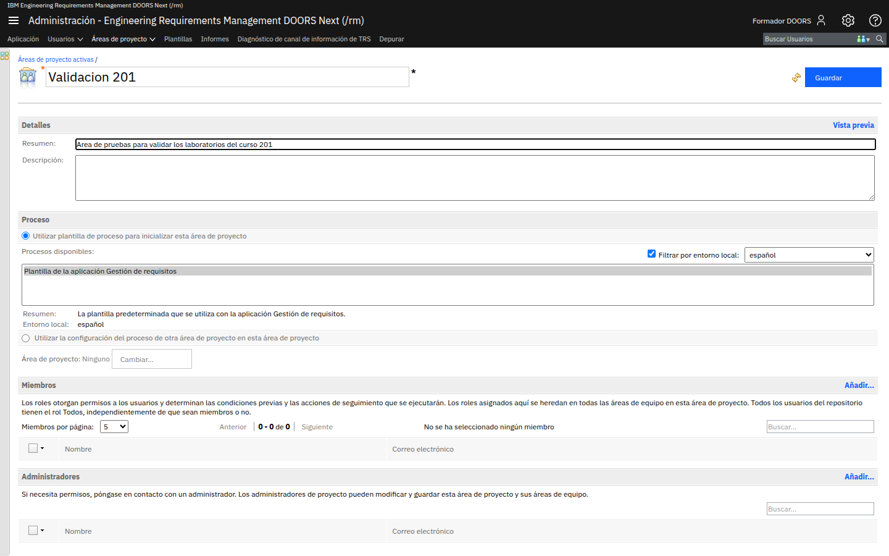
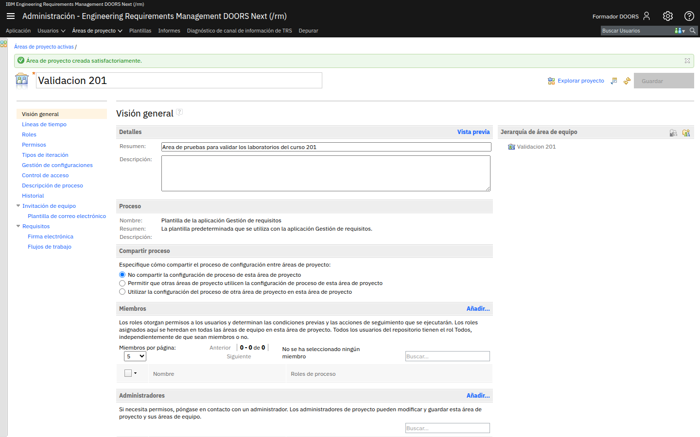
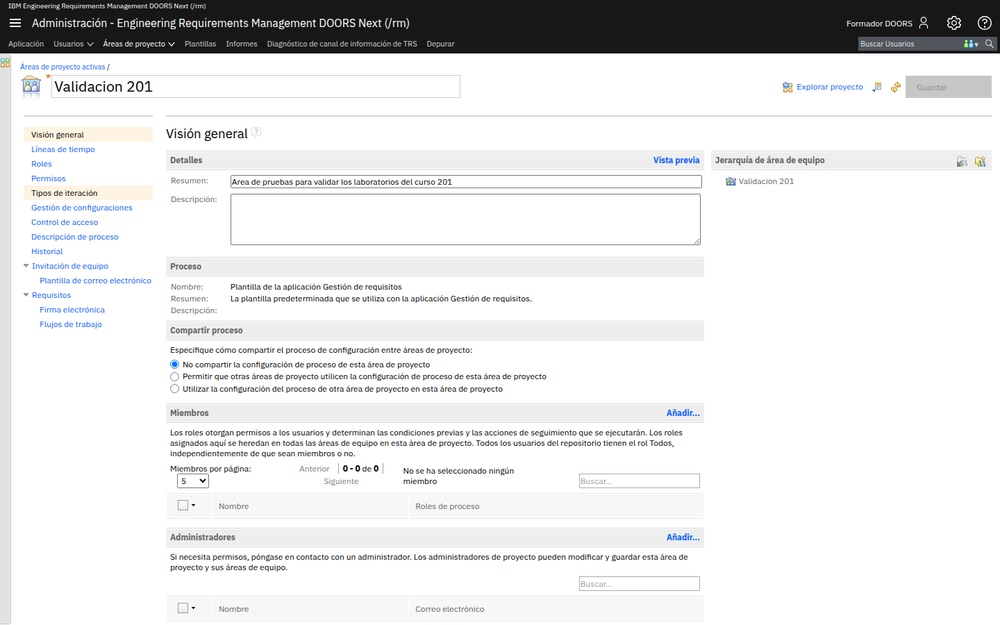
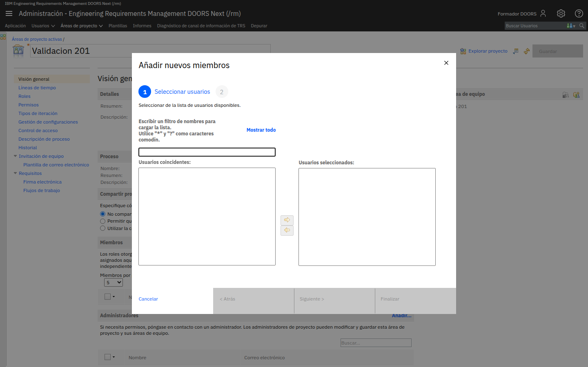
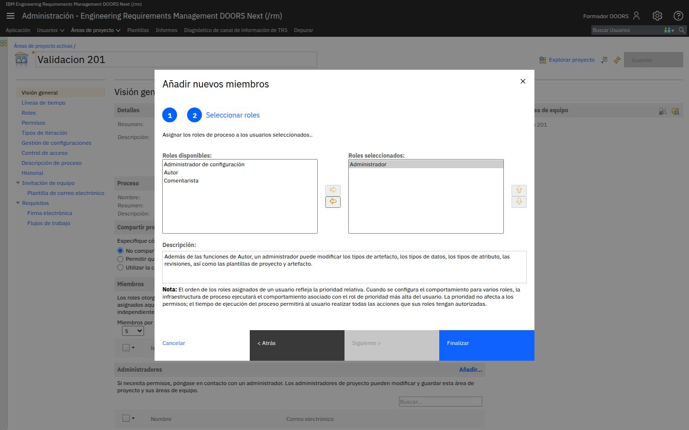
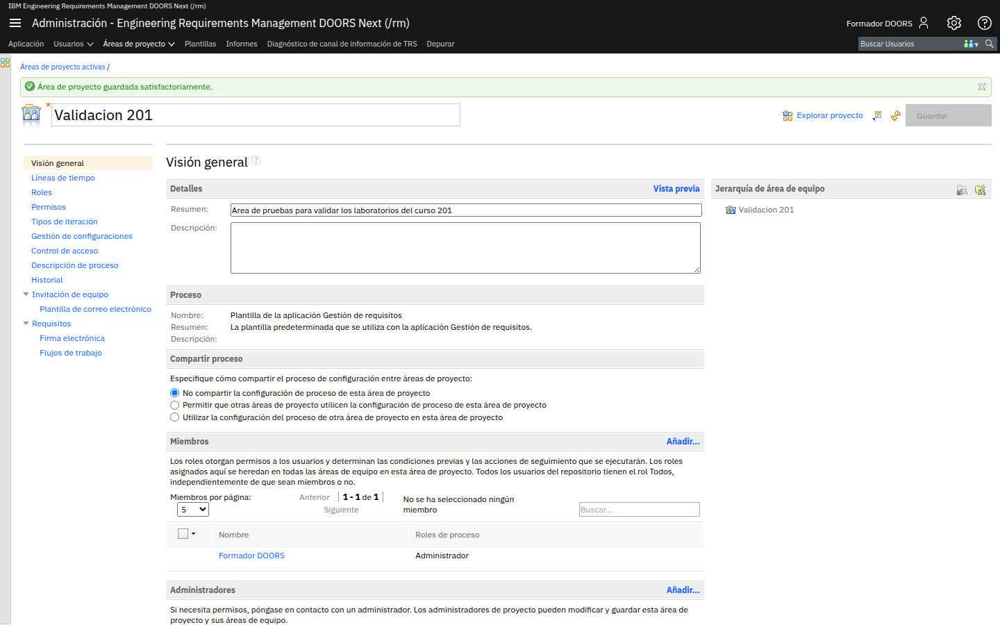
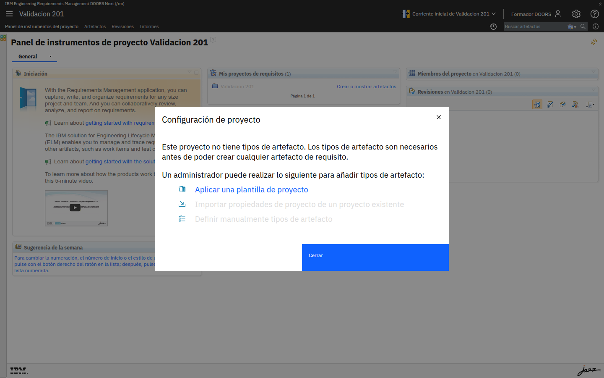
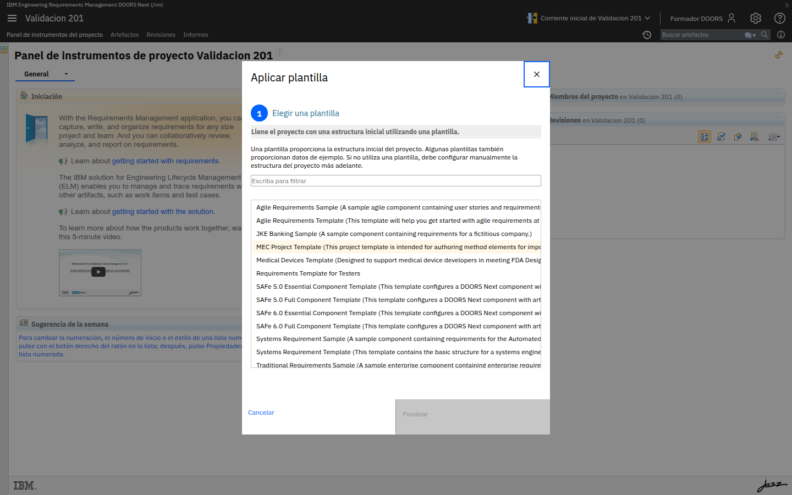
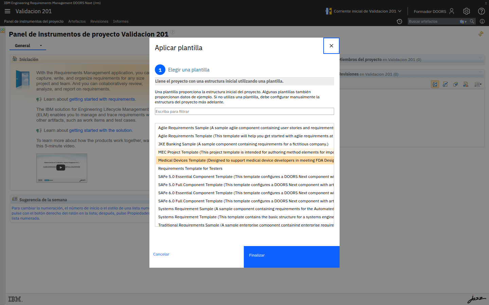
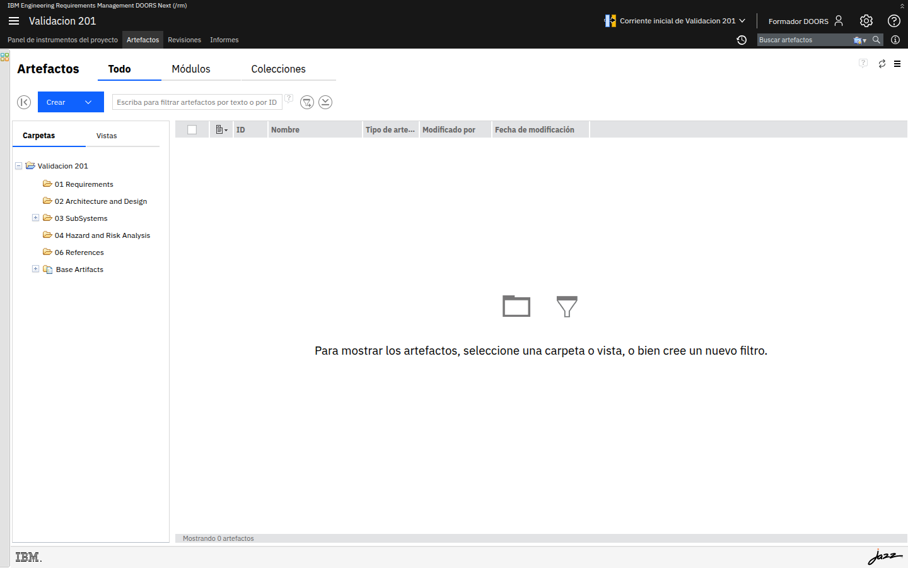

# M201-01 · Proyecto y modelo base

[← Página anterior](README.md) · [Siguiente página →](M201-02-anatomia-del-metamodelo.md)

> [!NOTE]
> **Objetivo** — crear **tu** área de proyecto en DOORS Next, darte los permisos que de verdad
> hacen falta para trabajar en él, y descubrir de primera mano que un proyecto recién creado
> **no puede contener ni un solo requisito** hasta que alguien define su modelo de información.
>
> ⏱️ ~20 min · 🗂️ Sobre el servidor de clase · 🎯 Resultado: un proyecto tuyo, con rol de administrador y un modelo de dispositivo médico.

---

## En qué consiste

Vas a crear un área de proyecto desde la administración de DOORS Next, te darás de alta en ella
como miembro con el rol adecuado, comprobarás que está vacía de tipos, y le aplicarás la
plantilla **Medical Devices**, que trae un modelo de requisitos completo para desarrollo
regulado. Ese proyecto será tu campo de trabajo durante todo el curso.

> [!IMPORTANT]
> **No te salgas del orden y no te salgas de ningún paso**, en particular el **paso 4**. Es el
> que reparte los permisos, y sin él los laboratorios siguientes se abren en modo lectura.

## Antes de empezar necesitas

- El entorno arrancado y acceso a `https://localhost:9443/rm` (ver [infra/README.md](../../infra/README.md)).
- Una cuenta con permisos de administración y licencia **DOORS Next Analyst**.

> [!TIP]
> **Nombra tu proyecto con tu nombre o iniciales** (por ejemplo `DPM - Marcapasos`). En el
> servidor de clase conviven los proyectos de todos y se mezclan enseguida.

---

## Conceptos clave

| Concepto | Qué es |
|---|---|
| **Área de proyecto** | El contenedor de todo: artefactos, miembros, roles, permisos y el modelo de información. |
| **Plantilla de proceso** | Define el comportamiento del área: roles, permisos y flujos. Se elige al crear el área. |
| **Plantilla de proyecto** | Cosa distinta: rellena el proyecto con **tipos de artefacto, atributos y estructura de carpetas**, y a veces con datos de ejemplo. Se aplica después. |
| **Componente** | La unidad que contiene los artefactos. Un proyecto nuevo trae uno. |
| **Corriente** (stream) | La línea de trabajo sobre la que editas. Verás arriba *Corriente inicial de…*. |

> [!IMPORTANT]
> **Plantilla de proceso y plantilla de proyecto no son lo mismo**, y es la confusión más
> habitual. La primera decide *quién puede hacer qué*; la segunda, *qué información existe*.
> Al crear el área eliges la de proceso; los tipos de artefacto llegan con la de proyecto.

---

## Paso a paso

### Paso 1 · Entra en la administración de DOORS Next

**Acción** — abre `https://localhost:9443/rm/admin` e inicia sesión. En el menú superior entra
en **Áreas de proyecto**.

**Qué ves** — si el servidor está recién preparado, el mensaje **No hay áreas de proyecto**.
Arriba tienes los enlaces **Crear área de proyecto** y *Crear proyecto de ciclo de vida*.

> [!NOTE]
> **Por qué** — un servidor ELM recién configurado no trae proyectos. Todo lo que veas en clase
> lo habréis creado vosotros, lo que hace el ejercicio realista: así empiezan los proyectos de verdad.

---

### Paso 2 · Crea el área de proyecto

**Acción** — pulsa **Crear área de proyecto**. Rellena:

- **Nombre**: el tuyo (por ejemplo `DPM - Marcapasos`).
- **Resumen**: una línea que describa el sistema.

**Qué ves** — más abajo, la sección **Proceso** con la opción *Utilizar plantilla de proceso
para inicializar esta área de proyecto* ya marcada y una única plantilla disponible:
**Plantilla de la aplicación Gestión de requisitos**, con el entorno local en *español*.
Debajo, las secciones **Miembros** y **Administradores**, ambas vacías.

> [!TIP]
> **Opciones** — la alternativa *Utilizar la configuración del proceso de otra área de proyecto*
> hace que tu proyecto **herede** el proceso de otro. Es la forma de mantener una única
> definición de roles y permisos en muchos proyectos, y la verás en el módulo 205.

---

### Paso 3 · Guarda y observa las pestañas que aparecen

**Acción** — pulsa **Guardar** y espera. Tarda unos segundos porque despliega la plantilla de
proceso y crea el componente inicial.

**Qué ves** — el mensaje **Área de proyecto creada satisfactoriamente** y, sobre todo, una
fila de pestañas que es el mapa de casi todo el curso:

| Pestaña | Módulo del curso donde se usa |
|---|---|
| **Roles**, **Permisos**, **Flujos de trabajo**, **Control de acceso** | M202 · Gobernanza |
| **Gestión de configuraciones** | M206 · Configuraciones |
| **Requisitos** | M201 · este módulo |
| **Firma electrónica** | M202 · trazas de aprobación |
| **Líneas de tiempo**, **Tipos de iteración** | Planificación |

> [!NOTE]
> **Por qué** — merece la pena detenerse aquí treinta segundos. Todo lo que configurarás en los
> próximos módulos cuelga de esta pantalla, así que conviene reconocerla.

---

### Paso 4 · Añádete como miembro y dale un rol

> [!WARNING]
> **Este paso parece burocrático y no lo es: sin él, el resto del curso no funciona.** Acabas
> de crear el proyecto, pero DOORS Next **no te considera miembro de él**. Y en Jazz los
> permisos no los da el ser administrador: los dan los **roles asignados a los miembros**. Si te
> lo saltas, el editor del modelo de información se abrirá en **solo lectura** y no entenderás
> por qué.

**Acción** — en el área de proyecto, baja a la sección **Miembros**.

**Qué ves** — el contador dice **0 - 0 de 0** y el mensaje *No se ha seleccionado ningún
miembro*. Fíjate también en el aviso de la propia sección, que explica el mecanismo entero:

> Los roles otorgan permisos a los usuarios […]. Todos los usuarios del repositorio tienen el
> rol **Todos**, independientemente de que sean miembros o no.

Es decir: ahora mismo tu único rol en este proyecto es *Todos*, el más básico que existe.

**Acción** — antes de añadirte, mira qué roles hay. Pulsa **Roles** en el menú de la izquierda.

**Qué ves** — la plantilla de gestión de requisitos define cuatro roles. Lee la descripción del
primero, porque es la clave de este paso:

| Rol | Qué permite |
|---|---|
| **Administrador** | *"Además de las funciones de Autor, un administrador puede modificar los tipos de artefacto, los tipos de datos, los tipos de atributo, las revisiones, así como las plantillas de proyecto y artefacto."* |
| **Autor** | Crear y editar artefactos, pero no tocar el modelo |
| **Comentarista** | Solo leer y comentar |
| **Administrador de configuración** | Gestionar corrientes, líneas base y conjuntos de cambios (M206) |

**Acción** — vuelve a **Visión general** y, en **Miembros**, pulsa **Añadir…**. Se abre un
asistente de dos pasos.

**Acción** — en *Seleccionar usuarios*, escribe tu usuario en el filtro y pulsa <kbd>Enter</kbd>
(o usa **Mostrar todo**). Cuando aparezca en **Usuarios coincidentes**, haz **doble clic** sobre
él para pasarlo a **Usuarios seleccionados**. Pulsa **Siguiente >**.

**Acción** — en *Seleccionar roles*, pasa **Administrador** de *Roles disponibles* a *Roles
seleccionados* (otra vez, doble clic). Añade también **Administrador de configuración**, que
necesitarás en el módulo M206. Pulsa **Finalizar**.

**Acción** — y ahora lo que más se olvida: pulsa **Guardar** arriba a la derecha. El asterisco
del título (`*Validacion 201`) desaparece.

**Qué ves** — la tabla de miembros ya te lista, con **Administrador** en la columna *Roles de
proceso*.

> [!IMPORTANT]
> **Ser administrador del área y ser miembro con rol son cosas distintas.** Al crear el proyecto
> quedaste en **Administradores**, lo que te permite editar *esta pantalla*. Pero para editar el
> **contenido y el modelo** del proyecto necesitas ser **miembro** con un rol que lo autorice.
> Es la confusión que más tiempo hace perder en las implantaciones reales.

> [!NOTE]
> **Por qué el orden de los roles importa** — un usuario puede tener varios roles, y el
> asistente avisa de que *el orden de los roles asignados refleja su prioridad*. Cuando dos
> roles dicen cosas contrarias sobre un permiso, manda el que está más arriba.

---

### Paso 5 · Comprueba que el proyecto no puede tener requisitos todavía

**Acción** — pulsa **Explorar proyecto** (o entra por `https://localhost:9443/rm` y abre tu
proyecto en la lista).

**Qué ves** — un aviso de **Configuración de proyecto** que dice literalmente:

> Este proyecto no tiene tipos de artefacto. Los tipos de artefacto son necesarios antes de
> poder crear cualquier artefacto de requisito.

Y te ofrece tres caminos:

| Vía | Cuándo se usa |
|---|---|
| **Aplicar una plantilla de proyecto** | Arranque rápido con un modelo probado. Es la que usarás. |
| **Importar propiedades de proyecto de un proyecto existente** | Cuando ya tienes un proyecto de referencia y quieres el mismo modelo. Base de la reutilización del M205. |
| **Definir manualmente tipos de artefacto** | Cuando el modelo es propio desde cero. Lo harás en M201-03. |

> [!IMPORTANT]
> Este aviso es la mejor demostración de lo que dice el módulo: **sin modelo de información no
> hay requisitos posibles**. No es un requisito sin tipo, es que no se puede crear.

---

### Paso 6 · Aplica la plantilla de dispositivos médicos

**Acción** — pulsa **Aplicar una plantilla de proyecto**. Marca la casilla *Utilizar una
plantilla para llenar el proyecto inicialmente* y elige **Medical Devices Template**.

**Qué ves** — las plantillas que trae el servidor:

| Plantilla | Qué aporta |
|---|---|
| **Medical Devices Template** | Modelo para cumplir FDA Design Control: requisitos, riesgos y trade studies |
| Agile Requirements Template | Requisitos ágiles a escala |
| Agile Requirements Sample | Ejemplo con historias de usuario |
| JKE Banking Sample | Ejemplo de banca (es la del curso 101) |
| Requirements Template for Testers | Enfoque orientado a pruebas |
| MEC Project Template | Elementos de método |

**Acción** — pulsa **Finalizar** y espera. Tarda porque está creando tipos, atributos,
carpetas y un centenar de artefactos.

> [!TIP]
> **Por qué esta plantilla** — el desarrollo de dispositivos médicos está regulado, así que su
> modelo ya distingue requisitos de stakeholder, de sistema y de subsistema, e incorpora
> riesgos. Es el escenario que mejor encaja con la gobernanza y la trazabilidad del curso.
> Además, si hiciste el 101 con *JKE Banking*, aquí verás un modelo nuevo.

---

### Paso 7 · Comprueba lo que ha traído la plantilla

**Acción** — vuelve al panel de instrumentos del proyecto y mira el widget **Cambios recientes**.

**Qué ves** — alrededor de **100 artefactos** agrupados en documentos con nombre propio:
*Vision Document*, *Stakeholder requirements*, *System Requirements*, *Subsystem A
Requirements*, *Risks*, *Trade Study*, *Project Glossary* y *Exemplar Reference Document*.

**Acción** — entra en la pestaña **Artefactos**.

**Qué ves** — a la izquierda la estructura de carpetas que ha creado la plantilla:

- `01 Requirements`
- `02 Architecture and Design`
- `03 SubSystems`
- `04 Hazard and Risk Analysis`
- `06 References`
- `Base Artifacts`

Y arriba, las tres pestañas **Todo · Módulos · Colecciones**, además de los selectores
**Carpetas** y **Vistas**.

> [!NOTE]
> **Por qué la numeración de carpetas** — `01`, `02`, `03`… fuerza el orden alfabético para que
> la estructura refleje el flujo de ingeniería: primero requisitos, luego diseño, luego
> subsistemas, luego análisis de riesgos. Es una convención que verás en muchos proyectos.

> [!TIP]
> Si la lista de artefactos aparece vacía con el mensaje *Para mostrar los artefactos,
> seleccione una carpeta o vista*, es normal: selecciona una carpeta a la izquierda.

---

## ✅ Resultado

- Tienes tu propia área de proyecto en DOORS Next, con su corriente inicial.
- Eres **miembro** del proyecto con el rol **Administrador**, que es lo que te permitirá editar
  el modelo de información en los laboratorios siguientes.
- Sabes distinguir **plantilla de proceso** de **plantilla de proyecto**.
- Has comprobado que sin tipos de artefacto no hay requisitos posibles.
- Tu proyecto tiene un modelo de dispositivo médico con un centenar de artefactos.

## Comprueba

- [ ] Tu proyecto aparece en **Áreas de proyecto** de `/rm/admin`.
- [ ] En **Miembros** apareces tú, con **Administrador** en *Roles de proceso*.
- [ ] El título del área **no** lleva asterisco (no hay cambios sin guardar).
- [ ] Al abrir el proyecto **ya no** sale el aviso de que faltan tipos de artefacto.
- [ ] En **Artefactos** ves las carpetas `01 Requirements` … `06 References`.
- [ ] Arriba, junto al nombre del proyecto, se lee **Corriente inicial de …**.

## Errores frecuentes

> [!WARNING]
> - **No veo el enlace Crear área de proyecto** → tu usuario no está en *JazzAdmins* o no tiene
>   licencia asignada. Lo resolverás en el módulo M202.
> - **Guardé el área y no encuentro cómo entrar** → usa **Explorar proyecto** arriba a la
>   derecha del editor, o entra por `/rm` y abre la lista de proyectos.
> - **Añadí el miembro y sigue sin aparecer** → falta pulsar **Guardar** en el área de proyecto.
>   El asistente solo prepara el cambio; el asterisco del título te avisa de que está pendiente.
> - **En el asistente no consigo pasar el usuario a la derecha** → es **doble clic** sobre el
>   nombre en *Usuarios coincidentes*. Con un clic solo se marca, y *Siguiente >* sigue apagado.
> - **No encuentro mi usuario en el filtro** → escribe el identificador, no el nombre completo, o
>   usa **Mostrar todo**. Admite comodines `*` y `?`.
> - **Apliqué la plantilla y sigo sin tipos** → la aplicación tarda; recarga la página al cabo
>   de un minuto. Si el asistente se cerró sin llegar a *Finalizar*, repite el paso 6.
> - **Elegí una plantilla distinta** → no pasa nada grave, pero los nombres de los ejercicios
>   siguientes no coincidirán. Puedes crear otro proyecto y aplicar la correcta.
> - **El botón Finalizar está apagado** → falta marcar la casilla *Utilizar una plantilla* o
>   seleccionar una plantilla en la lista.

## 🏆 Reto

Tu organización va a arrancar ocho proyectos de la misma familia de producto, y quiere que
todos compartan exactamente el mismo modelo de requisitos. De las tres vías que te ofrecía
DOORS Next en el paso 5, ¿cuál elegirías y por qué las otras dos son peores?

Ver solución

 

**Importar propiedades de proyecto de un proyecto existente**, tomando como origen un proyecto
de referencia que actúe como modelo canónico.

Por qué no las otras:

- **Aplicar una plantilla** no garantiza que los ocho sigan iguales: en cuanto alguien añada un
  atributo en su proyecto, los modelos empiezan a divergir y nadie se entera. Además, la
  plantilla es un punto de partida genérico, no el modelo de *tu* organización.
- **Definir manualmente** ocho veces el mismo modelo es una invitación al error: bastará con que
  alguien escriba *Criticidad* en lugar de *Criticidad de seguridad* para que los informes
  consolidados dejen de cuadrar.

La respuesta completa apunta más allá: para que los ocho proyectos **se mantengan** iguales en
el tiempo, además de importar el modelo interesa que compartan la **configuración de proceso**
(la opción *Utilizar la configuración del proceso de otra área de proyecto* del paso 2), de modo
que roles y permisos se administren en un solo sitio. Eso se trabaja en el módulo M205.

