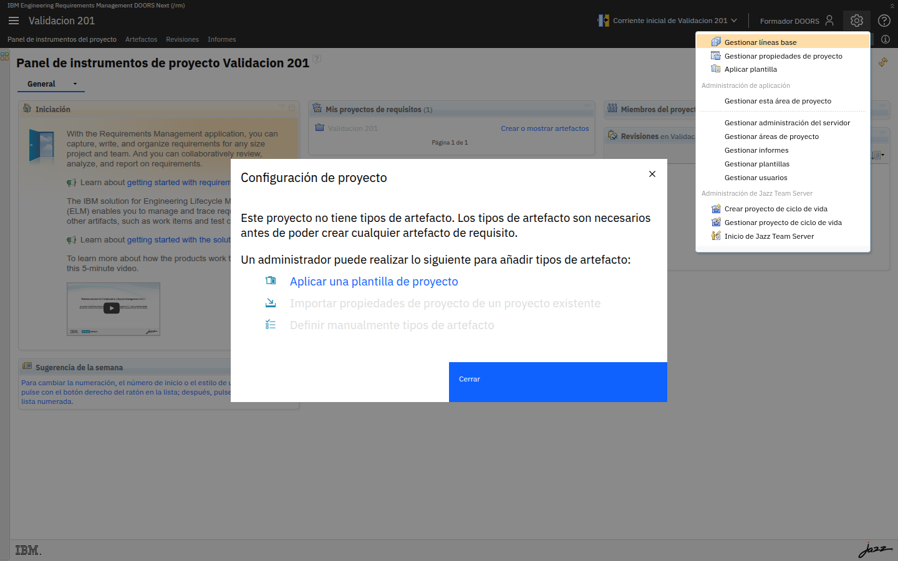
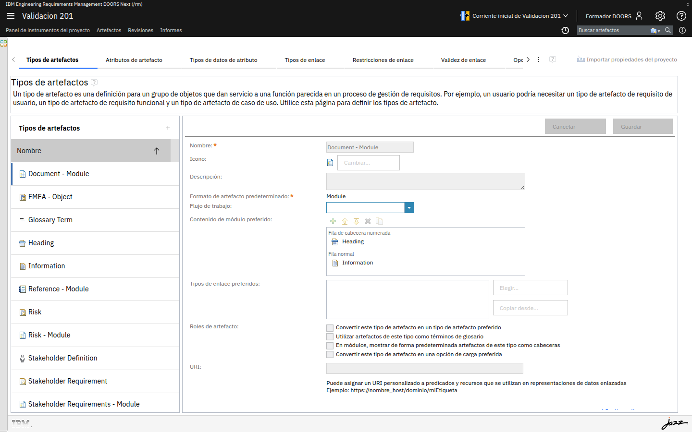
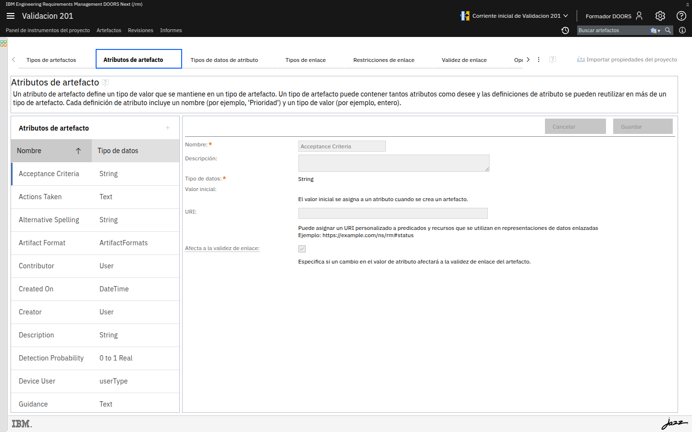
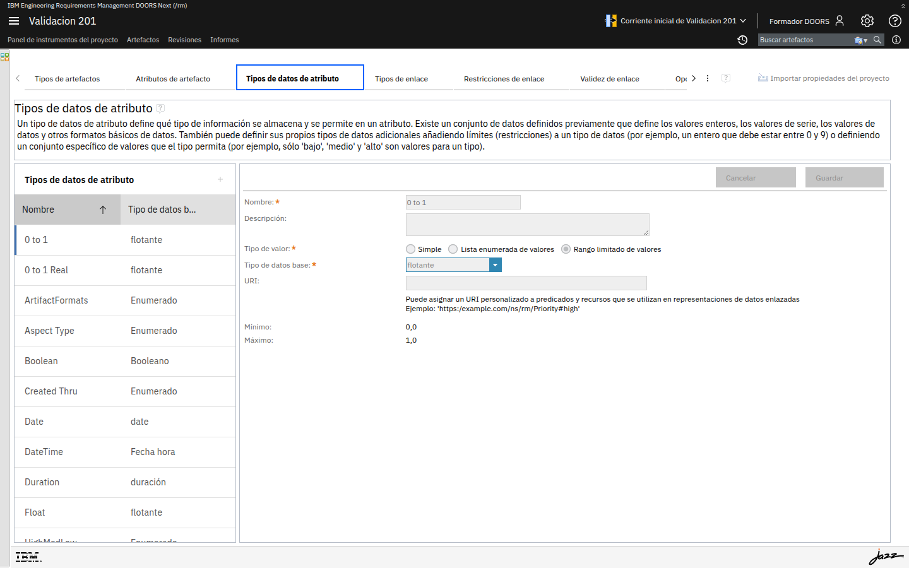
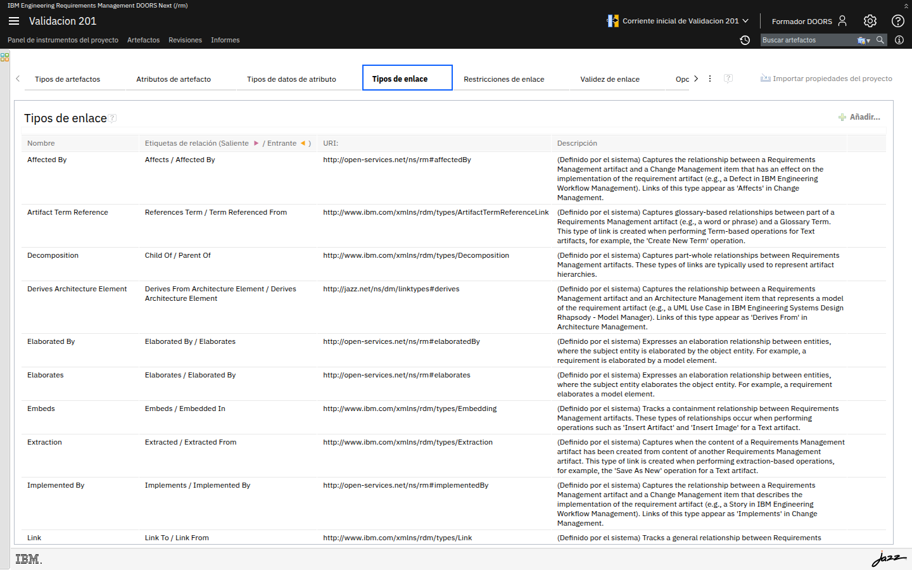
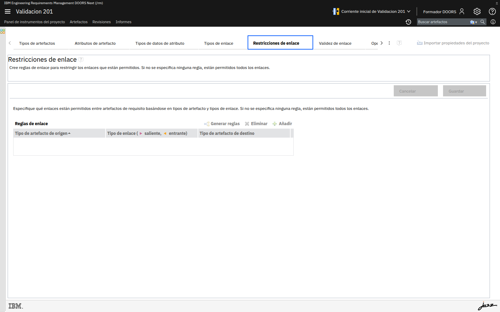
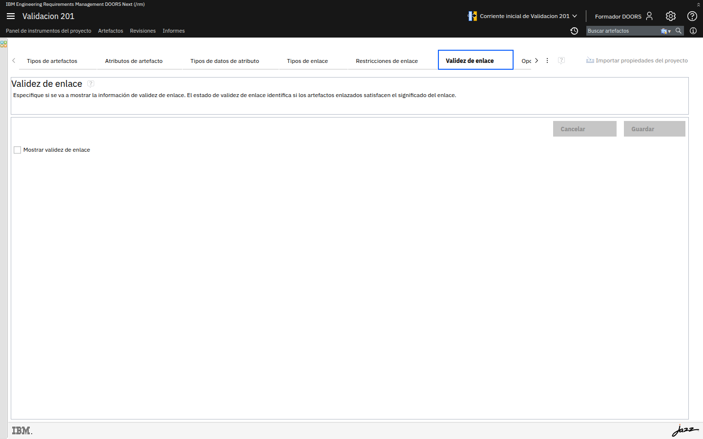

# M201-02 · Anatomía del metamodelo

[← Página anterior](M201-01-proyecto-y-modelo-base.md) · [Siguiente página →](M201-03-extender-el-modelo.md)

> [!NOTE]
> **Objetivo** — abrir el editor del modelo de información y aprender a **leerlo**. Al acabar
> sabrás decir, de cualquier requisito de un proyecto ajeno, qué atributos tiene y por qué,
> con qué se puede enlazar y qué pasa cuando cambia.
>
> ⏱️ ~15 min · 🗂️ Sobre tu proyecto de M201-01 · 🎯 Resultado: sabes recorrer las siete secciones del metamodelo.

---

## En qué consiste

Este laboratorio es de **lectura**, no de creación: no vas a modificar nada. Vas a recorrer las
siete secciones del editor de propiedades del proyecto y a diseccionar un tipo de artefacto
real de los que trajo la plantilla, de arriba abajo. Es el paso previo imprescindible al
siguiente laboratorio, donde ya crearás.

## Antes de empezar necesitas

- Haber completado [M201-01](M201-01-proyecto-y-modelo-base.md): tu proyecto con la plantilla
  **Medical Devices** aplicada.

> [!TIP]
> **Resiste la tentación de tocar.** En esta página solo se mira. Si cambias algo por error,
> pulsa **Cancelar** (arriba a la derecha del panel), nunca **Guardar**.

---

## Conceptos clave

| Sección del editor | Qué contiene |
|---|---|
| **Tipos de artefactos** | Las clases de artefacto que existen: requisitos, cabeceras, riesgos, módulos… |
| **Atributos de artefacto** | Los campos disponibles y el tipo de datos de cada uno |
| **Tipos de datos de atributo** | Los dominios de valores: enumeraciones, enteros, rangos, texto |
| **Tipos de enlace** | Las relaciones posibles, con su nombre en cada dirección |
| **Restricciones de enlace** | Qué combinaciones origen–enlace–destino se permiten |
| **Validez de enlace** | Cuándo un enlace pasa a considerarse *sospechoso* |
| **Opciones** | Ajustes generales del proyecto |

---

## Paso a paso

### Paso 1 · Abre el editor del modelo

**Acción** — con tu proyecto abierto, pulsa el **icono de administración** (el engranaje, arriba
a la derecha) y elige **Gestionar propiedades de proyecto**.

**Qué ves** — una página con una fila de pestañas: *Tipos de artefactos*, *Atributos de
artefacto*, *Tipos de datos de atributo*, *Tipos de enlace*, *Restricciones de enlace*,
*Validez de enlace* y, tras la flecha **›**, *Opciones*.

> [!IMPORTANT]
> **Ojo al contexto de configuración.** Arriba, junto al nombre del proyecto, se lee
> **Corriente inicial de …**. El modelo de información se versiona igual que los requisitos:
> lo que cambies aquí pertenece a esa corriente. Es una de las razones por las que el módulo
> M206 es importante.

---

### Paso 2 · Disecciona un tipo de artefacto

**Acción** — en **Tipos de artefactos**, recorre la lista de la izquierda y selecciona
**`Document - Module`**.

**Qué ves** — a la izquierda, los **18 tipos** que trajo la plantilla, cada uno con su icono:

| Tipo | Para qué sirve |
|---|---|
| `Stakeholder Requirement`, `System Requirement` | Los dos niveles de requisito del modelo |
| `Stakeholder Definition`, `System Function` | Actores del sistema y funciones que realiza |
| `Risk`, `FMEA - Object` | Análisis de riesgos y de modos de fallo |
| `Trade Study - Document`, `Trade Study Assessment Criterion` | Decisiones de ingeniería y sus criterios |
| `Heading`, `Information` | Estructura y texto no normativo dentro de un documento |
| `Glossary Term` | Vocabulario del proyecto |
| `… - Module` (`Document`, `Risk`, `System Requirements`, `Vision Document`…) | Tipos de **módulo**, no de requisito |

A la derecha, el detalle del tipo seleccionado:

| Campo | Qué significa |
|---|---|
| **Nombre** | Cómo se llama el tipo. Es lo que verás en la columna *Tipo de artefacto*. |
| **Icono** | Su representación visual en las listas. Se cambia con *Cambiar…* |
| **Formato de artefacto predeterminado** | Aquí vale **Module**: por eso este tipo es un documento contenedor y no un requisito. |
| **Flujo de trabajo** | El ciclo de estados asociado. Está **vacío**: la plantilla no define flujo, y de ahí que en el 101 la columna *Estado* apareciera en blanco. Lo configurarás en el M202. |
| **Contenido de módulo preferido** | Qué tipos se ofrecen al escribir dentro del módulo: *Fila de cabecera numerada* → `Heading`, *Fila normal* → `Information`. |
| **Tipos de enlace preferidos** | Los enlaces que se sugieren primero al enlazar artefactos de este tipo. |
| **Roles de artefacto** | Cuatro casillas de comportamiento (ver abajo). |
| **URI** | Identificador propio para datos enlazados. Es la puerta al M209 y a OSLC. |

> [!NOTE]
> **Las cuatro casillas de Roles de artefacto** son ajustes de usabilidad con mucho efecto:
> convertirlo en **tipo preferido** (aparece antes en los menús), usar sus artefactos como
> **términos de glosario** (se subrayan automáticamente en el texto), mostrarlos como
> **cabeceras** en los módulos, y hacerlo **opción de carga preferida**.

> [!TIP]
> **Compara dos tipos.** Selecciona ahora `Stakeholder Requirement` y fíjate en que su
> **Formato de artefacto predeterminado** ya no es *Module* sino texto. Ahí está, en un solo
> campo, la diferencia entre "un documento" y "un requisito".

---

### Paso 3 · Mira de dónde salen los campos de un requisito

**Acción** — abre la pestaña **Atributos de artefacto** y selecciona **`Acceptance Criteria`**.

**Qué ves** — la lista de atributos con dos columnas, **Nombre** y **Tipo de datos**, donde ya
se aprecia el criterio de modelado de la plantilla:

| Atributo | Tipo de datos | Comentario |
|---|---|---|
| `Acceptance Criteria` | String | Texto de una línea |
| `Actions Taken` | Text | Texto largo con formato |
| `Detection Probability` | 0 to 1 Real | Un decimal **acotado** entre 0 y 1, no un número libre |
| `Device User` | userType | Una **enumeración** propia del dominio |
| `Identifier` | Integer | Entero |
| `Created On` / `Creator` | DateTime / User | Atributos **de sistema**: los rellena DOORS Next |

Y a la derecha, el detalle:

| Campo | Qué significa |
|---|---|
| **Tipo de datos** | El dominio de valores. Es lo que se define en la sección siguiente. |
| **Valor inicial** | El valor que se asigna automáticamente al crear un artefacto. |
| **URI** | De nuevo, el identificador para datos enlazados. |
| **Afecta a la validez de enlace** | Si se marca, cambiar este atributo marca los enlaces del artefacto como **sospechosos**. |

> [!IMPORTANT]
> **Ese último campo es el más interesante de la pantalla.** Los *suspect links* que verás en el
> módulo M204 no son magia: se configuran aquí, atributo por atributo. Un cambio en el texto de
> un requisito debe poner en duda sus pruebas asociadas; un cambio en quién lo revisó, no.
> Marcar todos los atributos genera tanto ruido que el equipo deja de mirar los avisos.

---

### Paso 4 · Recorre los dominios de valores

**Acción** — abre **Tipos de datos de atributo**.

**Qué ves** — la lista con las columnas **Nombre** y **Tipo de datos base**. Los tipos base que
usa DOORS Next son pocos: *Serie* (texto), *Entero*, *flotante*, *Booleano*, *Fecha hora*,
*hora*, *duración*, *Usuario* y **Enumerado**.

Fíjate en los que ha añadido la plantilla, porque son ejemplos de buen modelado:

| Tipo de datos | Base | Por qué está así |
|---|---|---|
| `0 to 1` y `0 to 1 Real` | flotante | Rango **acotado**: una probabilidad no puede valer 7 |
| `Severity Type`, `Priority Type`, `Risk Assessment Type` | Enumerado | Escalas cerradas del análisis de riesgos |
| `HighMedLow`, `Yes/No` | Enumerado | Escalas genéricas reutilizables |
| `userType`, `Organization Type` | Enumerado | Vocabulario del dominio médico |
| `Ver Method Type`, `Val Method Type` | Enumerado | Métodos de verificación y validación |

> [!NOTE]
> **Por qué tantas enumeraciones** — porque son la única forma de garantizar que un informe de
> riesgos cuadre. Con texto libre, *Alto*, *alto* y *ALTO* son tres valores distintos y ninguna
> gráfica sale bien.

---

### Paso 5 · Entiende que los enlaces tienen dos nombres

**Acción** — abre **Tipos de enlace**.

**Qué ves** — tres columnas: el **nombre**, el **par de nombres** (saliente / entrante) y la
**URI** del tipo. Esto último es clave: son URIs del estándar **OSLC**, no inventos de IBM.

| Tipo de enlace | Par de nombres | URI |
|---|---|---|
| `Decomposition` | Child Of / Parent Of | *(interna)* |
| `Elaborates` | Elaborates / Elaborated By | `http://open-services.net/ns/rm#elaborates` |
| `Affected By` | Affects / Affected By | `http://open-services.net/ns/rm#affectedBy` |
| `Implemented By` | Implements / Implemented By | `http://open-services.net/ns/rm#implementedBy` |
| `Satisfaction` | Satisfies / Satisfied By | `http://open-services.net/ns/rm#satisfies` |
| `Validated By` | Validates / Validated By | `http://open-services.net/ns/rm#validatedBy` |

> [!IMPORTANT]
> **Un enlace es una relación con dos lecturas.** El mismo enlace se lee *"A satisface a B"*
> desde un extremo y *"B es satisfecho por A"* desde el otro. Por eso al definir un tipo de
> enlace hay que dar **los dos nombres**: si eliges mal, la trazabilidad se lee al revés y las
> matrices de cobertura confunden a todo el mundo.

> [!NOTE]
> **Por qué las URIs de OSLC importan** — son las que permiten que un requisito de DOORS Next
> se enlace con un caso de prueba de ETM aunque sean aplicaciones distintas. Los tipos con URI
> `open-services.net` son **interoperables**; uno que definas tú, con tu propia URI, solo lo
> entenderá tu proyecto. Volverás a esto en el M204 y el M209.

---

### Paso 6 · Descubre los dos mecanismos de control

**Acción** — abre **Restricciones de enlace**.

**Qué ves** — una tabla de tres columnas, **Tipo de artefacto de origen**, **Tipo de enlace
(saliente, entrante)** y **Tipo de artefacto de destino**, con los botones **Añadir** y
**Eliminar**. Está **vacía**.

> [!IMPORTANT]
> **Tabla vacía significa "todo permitido".** Ahora mismo cualquiera puede enlazar un término de
> glosario con un criterio de trade study usando *Satisfies*. No dará error, y no tendrá ningún
> sentido. Añadirás tu primera restricción en el laboratorio siguiente.

**Acción** — abre **Validez de enlace**.

**Qué ves** — también vacía. Aquí se declara qué tipos de enlace deben marcarse como
sospechosos y en qué dirección, y funciona junto con la casilla *Afecta a la validez de enlace*
que viste en el paso 3.

> [!TIP]
> **Opciones** — la última pestaña, tras la flecha **›**, es *Opciones*, con ajustes generales
> del proyecto. Y arriba a la derecha, **Importar propiedades del proyecto** es el mecanismo de
> reutilización del modelo entre proyectos que trabajarás en el M205.

---

## ✅ Resultado

- Sabes llegar al editor del modelo y moverte por sus siete secciones.
- Puedes explicar qué hace que un tipo sea "módulo" y no "requisito".
- Sabes de dónde salen los atributos de un requisito y qué es un valor inicial.
- Entiendes que un tipo de enlace tiene dos nombres y, a veces, una URI estándar de OSLC.
- Has visto que las restricciones y la validez de enlace están **vacías** por defecto.

## Comprueba

- [ ] Localizas los 18 tipos de artefacto de la plantilla.
- [ ] Sabes decir el **formato predeterminado** de `Document - Module` y el de `Stakeholder Requirement`.
- [ ] Encuentras el atributo `Detection Probability` y sabes por qué su tipo es `0 to 1 Real`.
- [ ] Sabes en qué campo del atributo se activan los enlaces sospechosos.
- [ ] Has comprobado que **Restricciones de enlace** no tiene ninguna fila.

## Errores frecuentes

> [!WARNING]
> - **No encuentro "Gestionar propiedades de proyecto"** → estás en la administración del
>   servidor (`/rm/admin`) y no dentro del proyecto. Abre el proyecto primero.
> - **La pestaña *Opciones* no aparece** → está oculta tras la flecha **›** del final de la fila
>   de pestañas; la ventana es demasiado estrecha para mostrarlas todas.
> - **Los campos se ven grises y no puedo escribir** → en esta página es lo normal, porque solo
>   consultas. Pero si en el laboratorio siguiente **el botón + también está apagado**, entonces
>   te falta el rol: repasa el [paso 4 de M201-01](M201-01-proyecto-y-modelo-base.md).
> - **Toqué algo sin querer** → **Cancelar**, no *Guardar*. Si ya guardaste, vuelve a dejar el
>   valor anterior; nada de lo de esta página es irreversible todavía.

## 🏆 Reto

Un compañero te dice: *"he marcado la casilla* Afecta a la validez de enlace *en todos los
atributos del proyecto, así no se nos escapa ningún cambio"*. Explica por qué esa decisión
consigue justo lo contrario de lo que pretende.

Ver solución

 

Porque convierte el aviso en ruido. Si cualquier cambio marca los enlaces como sospechosos,
entonces basta con que alguien corrija una falta de ortografía en la descripción, o con que el
propio sistema actualice *Modified On*, para que decenas de enlaces aparezcan en duda.

Cuando la lista de enlaces sospechosos está siempre llena, el equipo deja de revisarla, y a
partir de ese momento un cambio que **sí** invalidaba una prueba pasa desapercibido entre los
cien que no. El mecanismo sigue funcionando técnicamente, pero ha dejado de informar.

El criterio correcto es marcar solo los atributos que **cambian el significado** del requisito:
su texto, su criterio de aceptación, su criticidad. No los de gestión: el estado de revisión, el
responsable asignado o los comentarios.

