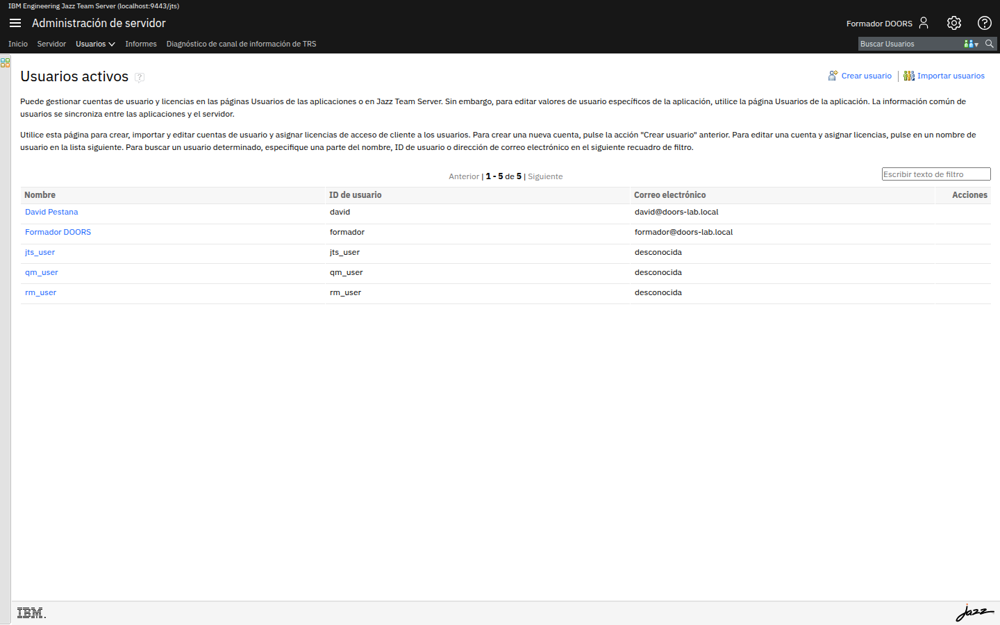
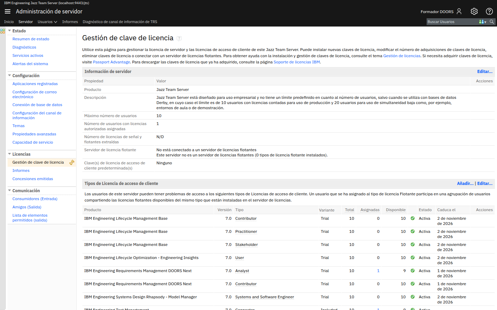
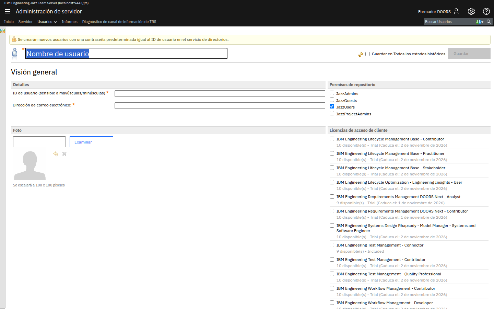

# M202-01 · Usuarios y licencias

[← Página anterior](README.md) · [Siguiente página →](M202-02-roles-y-permisos.md)

> [!NOTE]
> **Objetivo** — montar el equipo con el que trabajarás el resto del curso: crear las cuentas de
> un **autor** y un **aprobador**, entender qué es una licencia de acceso de cliente y
> comprobar que las cuentas nuevas pueden entrar de verdad.
>
> ⏱️ ~20 min · 🗂️ Administración de JTS · 🎯 Resultado: dos usuarios nuevos operativos, con licencia.

---

## En qué consiste

Hasta ahora has trabajado con un solo usuario que lo podía todo. Eso hace imposible probar un
circuito de aprobación: si el autor aprueba sus propios requisitos, no hay circuito. Vas a crear
dos cuentas con perfiles distintos, que en el laboratorio M202-03 se repartirán el trabajo.

Este es un laboratorio de **administración del servidor**, no de proyecto. Trabajas en la
consola de **Jazz Team Server**, que es la capa por debajo de DOORS Next.

## Antes de empezar necesitas

- El entorno arrancado y tu usuario con permisos de administración.
- Haber completado el [módulo M201](../M201-modelo-requisitos/README.md).

> [!TIP]
> **Trabajas en tu propio servidor**, así que las licencias que veas son tuyas y no compites por
> ellas con nadie. Puedes crear usuarios sin miedo a dejar sin licencia a un compañero.

---

## Conceptos clave

| Concepto | Qué es |
|---|---|
| **JTS** (Jazz Team Server) | La base común de todas las aplicaciones ELM: usuarios, licencias y registro de aplicaciones. No gestiona requisitos. |
| **CAL** (Client Access License) | La licencia que habilita a una persona a usar un producto concreto con un alcance concreto. |
| **Analyst** | Licencia de DOORS Next con capacidad completa: crear y editar requisitos, módulos y vistas. |
| **Contributor** | Licencia más ligera: participar y editar de forma limitada. Suficiente para revisar y comentar. |
| **Stakeholder** | Licencia de solo consulta y comentario, pensada para perfiles de negocio. |
| **Grupo de repositorio** | Permiso a nivel de **servidor**: *JazzUsers* (usuario normal), *JazzAdmins* (administrador), *JazzProjectAdmins*, *JazzGuests*. |

> [!IMPORTANT]
> **Grupo de repositorio y rol de proyecto son cosas distintas y complementarias.** El grupo
> dice qué puedes hacer *en el servidor* (por ejemplo, crear áreas de proyecto). El rol dice qué
> puedes hacer *dentro de un proyecto concreto*. Un *JazzAdmins* sin rol en un proyecto sigue
> viendo ese proyecto en modo lectura, como comprobaste en M201.

---

## Paso a paso

### Paso 1 · Entra en la administración del servidor

**Acción** — abre `https://localhost:9443/jts/admin`. En el menú superior, despliega **Usuarios**
y elige **Gestión de usuarios activos**.

**Qué ves** — la lista de cuentas que existen en tu servidor, con las licencias asignadas a cada
una. Reconocerás las que trae la imagen preparada (`ADMIN`, `alumno`, `formador`).

> [!NOTE]
> **Por qué aquí y no en DOORS Next** — las cuentas y las licencias son del **servidor**, no de
> una aplicación. El mismo usuario que gestionas aquí sirve para DOORS Next y para Engineering
> Test Management. Por eso la administración de usuarios vive en `/jts` y no en `/rm`.

---

### Paso 2 · Mira el inventario de licencias antes de gastarlas

**Acción** — en el menú superior pulsa **Servidor** y elige **Gestión de claves de licencia**.
(También puedes abrir directamente
`https://localhost:9443/jts/admin#action=com.ibm.team.repository.admin.manageLicenses`.)

**Qué ves** — una tabla con **todas** las claves instaladas: unidades totales, asignadas,
disponibles y caducidad. En el entorno de clase las que importan son trials de 60 días, con
**10 unidades** cada una (Analyst, Contributor, Quality Professional…).

> [!WARNING]
> **No es el mismo menú que *Gestión de licencias de acceso de cliente*.** Ese vive bajo
> **Usuarios**, abre un desplegable de un solo tipo de licencia y suele caer en
> *QM Data Collector (Internal)*, que no tiene nadie asignado. Sirve para ver *quién* tiene
> una licencia concreta, no para ver el inventario. Si tu pantalla es un desplegable y una
> tabla vacía, estás ahí: sal y entra por **Servidor**.

> [!IMPORTANT]
> **Las licencias se agotan y la clase se para.** Diez unidades por tipo es de sobra para este
> curso, pero acostúmbrate a mirar el inventario **antes** de crear usuarios en masa: si asignas
> una licencia *Analyst* a diez cuentas de prueba, la undécima persona real se queda fuera con un
> error de licencia que parece un fallo del servidor y no lo es.

> [!TIP]
> **Fíjate en un detalle revelador** — verás licencias de **Workflow Management** disponibles.
> Existen porque el paquete de licencias las incluye, pero **esa aplicación no está instalada**
> en este entorno. Tener licencia no significa tener producto: son dos inventarios distintos.

---

### Paso 3 · Crea el usuario autor

**Acción** — vuelve a **Usuarios** y pulsa **Crear usuario**.

**Qué ves** — arriba, un aviso que conviene leer despacio porque es el que hace este laboratorio
posible:

> ⚠️ Se crearán nuevos usuarios con una contraseña predeterminada igual al **ID de usuario** en
> el servicio de directorios.

Es decir: si creas el usuario `autor`, su contraseña será `autor`. Cómodo para un laboratorio,
inaceptable en producción.

**Acción** — rellena el formulario:

| Campo | Valor |
|---|---|
| **Nombre de usuario** (arriba) | `Ana Autora` |
| **ID de usuario** | `autor` |
| **Dirección de correo electrónico** | `autor@doors-lab.local` |
| **Permisos de repositorio** | deja **JazzUsers** marcado, y nada más |
| **Licencias de acceso de cliente** | marca **IBM Engineering Requirements Management DOORS Next - Analyst** |

Pulsa **Guardar**.

> [!IMPORTANT]
> **El ID de usuario distingue mayúsculas de minúsculas**, y el propio formulario lo advierte. Si
> lo creas como `Autor` y luego intentas entrar como `autor`, no entrarás. Escríbelo todo en
> minúsculas y sé consistente.

> [!NOTE]
> **Por qué Analyst para el autor** — es la licencia que permite crear y editar requisitos,
> módulos y vistas. Un *Contributor* no podría hacer el trabajo de autoría del curso.

---

### Paso 4 · Crea el usuario aprobador

**Acción** — repite el paso anterior con estos datos:

| Campo | Valor |
|---|---|
| **Nombre de usuario** | `Alberto Aprobador` |
| **ID de usuario** | `aprobador` |
| **Dirección de correo electrónico** | `aprobador@doors-lab.local` |
| **Permisos de repositorio** | **JazzUsers** |
| **Licencias de acceso de cliente** | **DOORS Next - Analyst** |

Pulsa **Guardar**.

> [!TIP]
> **Por qué también Analyst y no Contributor** — para *aprobar* bastaría una licencia menor, pero
> en el laboratorio M202-03 el aprobador tendrá que ejecutar acciones de flujo de trabajo sobre
> requisitos, y con *Contributor* algunas operaciones quedan fuera. Dale *Analyst* y evitamos
> confundir un límite de licencia con un límite de permisos, que es justo lo que queremos
> aprender a distinguir.

---

### Paso 5 · Comprueba que las cuentas funcionan de verdad

Un usuario creado no sirve de nada hasta que se ha probado el acceso. Y aquí hay una sorpresa
pedagógica que merece la pena vivir.

**Acción** — abre una **ventana privada** del navegador (para no perder tu sesión de
administrador) y entra en `https://localhost:9443/rm` como `autor` / `autor`.

**Qué ves** — entra sin problema, y en la lista de proyectos **no aparece el proyecto que creaste
en M201**. O aparece pero no puede hacer nada con él.

> [!IMPORTANT]
> **Esto no es un error: es la tercera capa haciendo su trabajo.** `autor` tiene cuenta (capa 1) y
> licencia (capa 2), pero **no es miembro de tu proyecto** (capa 3), así que para él ese proyecto
> es ajeno. Lo arreglarás en el laboratorio siguiente, que es precisamente de lo que trata.

**Acción** — cierra la ventana privada y vuelve a tu sesión de administrador.

---

## ✅ Resultado

- Sabes que usuarios y licencias se administran en **JTS**, no en DOORS Next.
- Existen las cuentas `autor` y `aprobador`, con licencia **Analyst** y grupo **JazzUsers**.
- Sabes que la contraseña inicial coincide con el ID de usuario.
- Has comprobado en persona que tener cuenta y licencia **no** da acceso a un proyecto.

## Comprueba

- [ ] `autor` y `aprobador` aparecen en la gestión de usuarios activos.
- [ ] Ambos tienen la licencia **DOORS Next - Analyst** asignada.
- [ ] El inventario de licencias muestra **dos unidades menos** de *Analyst* que al empezar.
- [ ] Puedes iniciar sesión como `autor` / `autor` en `/rm`.

## Errores frecuentes

> [!WARNING]
> - **No puedo entrar con el usuario nuevo** → la contraseña es el **ID de usuario**, tal cual, y
>   distingue mayúsculas. Comprueba también que guardaste el formulario.
> - **Error de licencia al entrar (`CRRRW7281E`)** → olvidaste marcar la licencia, o marcaste una
>   que no corresponde a DOORS Next (por ejemplo una de *Test Management*).
> - **No veo el menú de creación de usuarios** → tu usuario no está en **JazzAdmins**, o estás en
>   `/rm/admin` (administración de DOORS Next) en lugar de `/jts/admin` (administración del
>   servidor). Son dos consolas distintas y se parecen.
> - **Mi gestión de licencias es un desplegable y una tabla vacía** → estás en **Usuarios →
>   Gestión de licencias de acceso de cliente**, no en el inventario. El paso 2 está en
>   **Servidor → Gestión de claves de licencia**.
> - **No queda ninguna unidad de la licencia** → alguien (probablemente tú, probando) la asignó a
>   cuentas que ya no usa. Retírala de esas cuentas y quedará libre.
> - **Perdí mi sesión de administrador al probar el usuario nuevo** → usa siempre una **ventana
>   privada** para probar otras cuentas, o acabarás repitiendo inicios de sesión todo el curso.

## 📝 Autoevaluación

Contesta sin volver atrás, y comprueba después.

**1.** Un compañero te dice que un usuario "no tiene permisos" porque al abrir un proyecto lo ve
todo en gris y no puede editar nada. ¿Qué **dos** capas descartarías inmediatamente y por qué?

**2.** Tienes 10 unidades de licencia *Analyst* y un equipo de 14 personas, de las cuales 6 solo
necesitan leer requisitos y dejar comentarios. ¿Cómo lo resuelves sin comprar licencias?

**3.** ¿Por qué la administración de usuarios está en `/jts` y no en `/rm`?

Ver respuestas

 

**1.** Descartas la **capa 1 (cuenta)** y la **capa 2 (licencia)**. Si hubiera fallado la cuenta,
no habría podido autenticarse y no estaría dentro. Si hubiera fallado la licencia, habría
recibido un error explícito de licencia al entrar en la aplicación. El hecho de que **entre y
vea** el proyecto en modo lectura señala a las capas 3 y 4: no es miembro, o su rol no tiene
concedida la operación. Empieza mirando **Miembros** del área de proyecto.

**2.** Asignas *Analyst* solo a las 8 personas que crean y editan requisitos, y a las 6 que solo
leen y comentan les das **Stakeholder** (o *Contributor*), que son licencias distintas con su
propio inventario de 10 unidades. El error habitual es asignar la licencia más potente a todo el
mundo "por si acaso" y quedarse sin unidades para quien de verdad la necesita.

**3.** Porque las cuentas y las licencias son del **servidor**, no de una aplicación. El mismo
usuario trabaja en DOORS Next y en Engineering Test Management, y su licencia determina a qué
productos accede. Si viviera en `/rm`, habría que replicar cada usuario en cada aplicación del
ciclo de vida.

