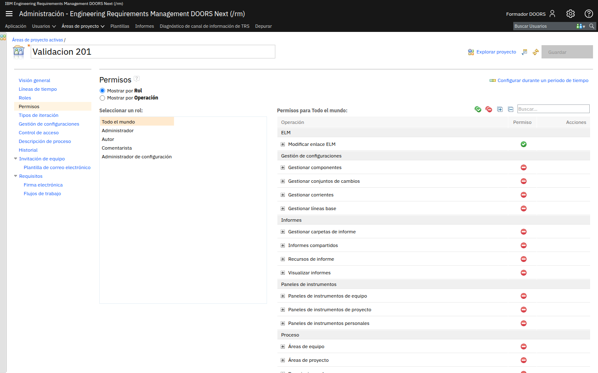
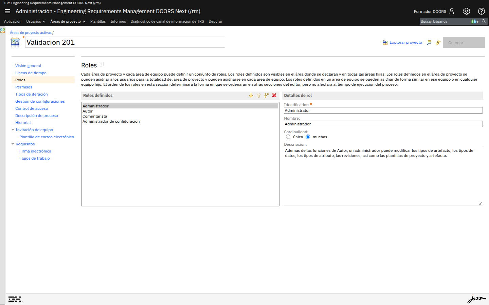
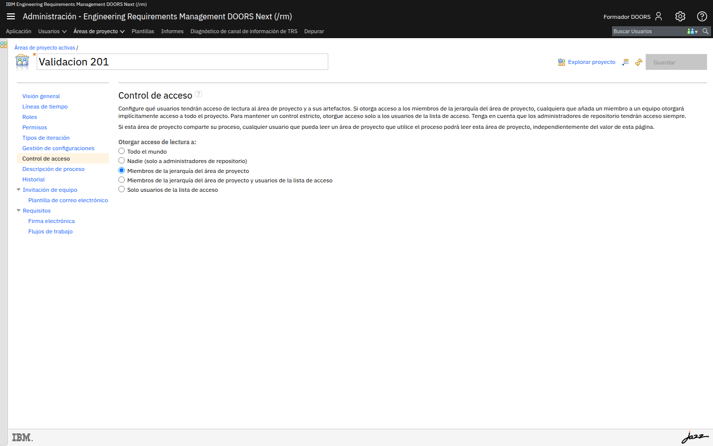

# M202-02 · Roles y permisos

[← Página anterior](M202-01-usuarios-y-licencias.md) · [Siguiente página →](M202-03-flujo-de-aprobacion.md)

> [!NOTE]
> **Objetivo** — incorporar a tu equipo al proyecto, crear un rol que la plantilla no trae
> (**Aprobador**) y repartir permisos de forma que cada perfil pueda hacer exactamente su
> trabajo y nada más. De paso, verás **el permiso concreto** que te dejó el metamodelo en solo
> lectura en M201.
>
> ⏱️ ~25 min · 🗂️ Área de proyecto → Roles, Permisos y Control de acceso · 🎯 Resultado: tres perfiles con capacidades distintas y demostrables.

---

## En qué consiste

Vas a trabajar en tres secciones del área de proyecto. Primero **Roles**, para crear el perfil de
aprobador que necesita el circuito. Después **Miembros**, para incorporar a las cuentas del
laboratorio anterior con su rol. Y por último **Permisos**, donde se decide de verdad quién puede
qué.

## Antes de empezar necesitas

- Haber completado [M202-01](M202-01-usuarios-y-licencias.md): las cuentas `autor` y `aprobador`
  creadas y con licencia.
- Tu proyecto de M201, y ser miembro de él con el rol **Administrador**.

---

## Conceptos clave

| Concepto | Qué es |
|---|---|
| **Rol** | Un perfil de participación que se define en el proyecto y se asigna a miembros |
| **Permiso** | La autorización para ejecutar una **operación** concreta |
| **Operación** | Cada acción que el sistema sabe distinguir: *Guardar artefacto*, *Guardar tipos*, *Importar ReqIF*… |
| **Rol `Todo el mundo`** | Un rol implícito que tienen **todos** los usuarios del repositorio, sean miembros o no |
| **Cardinalidad del rol** | Si el rol puede asignarse a una sola persona (*única*) o a varias (*muchas*) |
| **Control de acceso** | Quién puede **leer** el proyecto, decidido aparte de los permisos de operación |

> [!IMPORTANT]
> **Los permisos son acumulativos y el orden desempata.** Un usuario con varios roles suma los
> permisos de todos. Cuando dos roles se contradicen sobre una operación, manda el rol que esté
> **más arriba** en la lista de roles asignados a ese usuario. Por eso la pantalla de roles tiene
> flechas para moverlos.

---

## Paso a paso

### Paso 1 · Descubre el permiso que te bloqueó en M201

Empecemos resolviendo el misterio del módulo anterior, que además es la mejor manera de entender
esta pantalla.

**Acción** — en el área de proyecto, entra en **Permisos**. Arriba verás dos modos: **Mostrar por
Rol** y **Mostrar por Operación**. Deja *Mostrar por Rol* y selecciona el rol **Todo el mundo**.

**Qué ves** — a la izquierda la lista de roles (*Todo el mundo*, *Administrador*, *Autor*,
*Comentarista*, *Administrador de configuración*) y a la derecha las operaciones agrupadas por
categoría: **ELM**, **Gestión de configuraciones**, **Informes**, **Paneles de instrumentos**,
**Proceso** y **Recursos de gestión de requisitos**.

Cada operación lleva un icono: **✅ verde** si está concedida, **⛔ rojo** si está denegada. Para
*Todo el mundo* está casi todo en rojo.

**Acción** — busca en **Recursos de gestión de requisitos** la operación **`Guardar tipos`**.

**Qué ves** — está **denegada** para *Todo el mundo*.

> [!IMPORTANT]
> **Ahí está la explicación de M201.** `Guardar tipos` es la operación que autoriza a modificar
> el modelo de información. Cuando creaste el proyecto no eras miembro, así que tu único rol era
> *Todo el mundo*, que no la tiene concedida: por eso el editor del metamodelo se abría en solo
> lectura y el botón de crear estaba apagado. No era un fallo, era esta línea.

**Acción** — selecciona ahora el rol **Autor** y compara.

**Qué ves** — el *Autor* tiene concedido *Guardar artefacto*, *Guardar carpeta*, *Guardar
comentario*… pero **no** *Guardar tipos*. Puede escribir requisitos; no puede cambiar las reglas
del juego.

> [!NOTE]
> **Por qué esta separación es la buena práctica** — el modelo de información es infraestructura
> del proyecto. Si cualquier autor puede añadir tipos y atributos, en tres meses tendrás cuatro
> atributos que significan lo mismo con nombres distintos y ningún informe cuadrará.

> [!TIP]
> **Opciones** — el modo **Mostrar por Operación** invierte la pregunta: en vez de *"¿qué puede
> hacer este rol?"*, contesta *"¿quién puede hacer esto?"*. Es el modo útil cuando alguien
> reporta que no puede hacer algo. Y arriba a la derecha, **Configurar durante un periodo de
> tiempo** permite permisos con fecha, para congelar la edición durante una campaña de revisión.

---

### Paso 2 · Crea el rol Aprobador

La plantilla trae *Administrador*, *Autor*, *Comentarista* y *Administrador de configuración*.
Para un circuito de aprobación falta el perfil que aprueba y que **no** debe poder escribir
requisitos.

**Acción** — entra en **Roles**. En la cabecera del panel *Roles definidos* hay cuatro
controles: mover arriba, mover abajo, **Crear rol** y suprimir. Pulsa **Crear rol**.

**Acción** — rellena el detalle del rol:

| Campo | Valor |
|---|---|
| **Identificador** | `Approver` |
| **Nombre** | `Aprobador` |
| **Cardinalidad** | `muchas` |
| **Descripción** | `Revisa y aprueba requisitos. No los edita.` |

Pulsa **Guardar** arriba a la derecha.

> [!IMPORTANT]
> **El identificador es para siempre.** El *Nombre* se puede cambiar cuando quieras, pero el
> *Identificador* es la referencia técnica que usan la plantilla de proceso y las
> automatizaciones. Ponlo en inglés, sin espacios ni acentos, y no lo toques después.

> [!NOTE]
> **Por qué cardinalidad "muchas"** — porque puede haber varios aprobadores. La cardinalidad
> *única* se reserva para roles de los que solo puede haber uno en el proyecto.

---

### Paso 3 · Incorpora al equipo con sus roles

**Acción** — ve a **Visión general** → **Miembros** → **Añadir…** y repite el asistente de dos
pasos que ya conoces de M201-01:

| Usuario | Rol que le asignas |
|---|---|
| `autor` | **Autor** |
| `aprobador` | **Aprobador** |

**Acción** — pulsa **Guardar** en el área de proyecto.

**Qué ves** — la tabla de miembros lista ahora tres personas, cada una con su rol en la columna
*Roles de proceso*.

> [!TIP]
> Puedes añadir los dos usuarios en el mismo paso del asistente, pero **no** si les vas a dar
> roles distintos: los roles se asignan a todos los usuarios seleccionados a la vez. Con roles
> diferentes, hazlo en dos pasadas.

---

### Paso 4 · Da al aprobador lo que necesita, y solo eso

El rol `Aprobador` acaba de nacer y **no tiene ningún permiso**. Vamos a dárselos.

**Acción** — en **Permisos**, selecciona el rol **Aprobador** y concede estas operaciones dentro
de **Recursos de gestión de requisitos** (pulsa el icono de la columna *Permiso* de cada fila
para alternar entre concedido y denegado):

| Operación | Concedida | Por qué |
|---|---|---|
| **Guardar comentario** | ✅ | Un aprobador tiene que poder dejar observaciones |
| **Guardar la aprobación de la revisión** | ✅ | Es su función principal (M207) |
| **Guardar revisión** | ✅ | Para gestionar la revisión formal |
| **Guardar artefacto** | ⛔ **denegada** | Un aprobador **no** reescribe el requisito que juzga |
| **Guardar tipos** | ⛔ **denegada** | El modelo no es asunto suyo |

Pulsa **Guardar**.

> [!IMPORTANT]
> **Que el aprobador no pueda editar es una decisión de diseño, no una restricción mezquina.** Si
> quien aprueba puede además corregir el texto, la aprobación deja de ser un control
> independiente: siempre podrá dejarlo "como debería estar" y aprobarlo. La separación entre
> quien redacta y quien valida es el fundamento de cualquier auditoría.

> [!TIP]
> **Opciones** — los dos iconos de la esquina superior derecha de la tabla son **Otorgar permiso
> para todas las operaciones** y **Revocar permiso para todas las operaciones**. El segundo es
> muy útil para empezar de cero: revoca todo y concede solo lo que hace falta. El primero es
> tentador y casi siempre un error.

---

### Paso 5 · Decide quién puede leer el proyecto

Los permisos dicen qué se puede **hacer**. Quién puede **ver** el proyecto se decide aparte.

**Acción** — entra en **Control de acceso**.

**Qué ves** — cinco opciones de acceso de lectura:

| Opción | Qué implica |
|---|---|
| **Todo el mundo** | Cualquier usuario del repositorio puede leer el proyecto |
| **Nadie (solo administradores de repositorio)** | Cierre total |
| **Miembros de la jerarquía del área de proyecto** | Solo el equipo |
| **Miembros de la jerarquía y usuarios de la lista de acceso** | El equipo más invitados concretos |
| **Solo usuarios de la lista de acceso** | Control estricto, nominal |

**Acción** — para este curso, selecciona **Miembros de la jerarquía del área de proyecto** y
**Guarda**.

> [!IMPORTANT]
> **Lee el aviso de esa pantalla, que esconde una fuga de acceso.** Dice que si el área de
> proyecto **comparte su proceso**, cualquiera que pueda leer un área que use ese proceso podrá
> leer también esta, *independientemente del valor de esta página*. Es decir: compartir proceso
> entre proyectos (lo que verás en M205) puede abrir puertas de lectura que creías cerradas. En
> un proyecto con información sensible, hay que decidirlo a la vez, no por separado.

> [!NOTE]
> **Por qué no dejarlo en "Todo el mundo"** — en un servidor de clase da igual, pero en una
> organización real significa que cualquier empleado con cuenta puede leer los requisitos de
> cualquier proyecto. Rara vez es lo que se quiere, y casi nunca es lo que la gente cree que ha
> configurado.

---

## ✅ Resultado

- Sabes que **`Guardar tipos`** era el permiso que te bloqueaba en M201, y en qué rol vive.
- Has creado un rol propio, **Aprobador**, con su identificador y su cardinalidad.
- `autor` y `aprobador` son miembros del proyecto con roles distintos.
- El aprobador **puede** aprobar y comentar, y **no puede** editar requisitos ni el modelo.
- Has decidido explícitamente quién puede leer el proyecto.

## Comprueba

- [ ] En **Roles** aparece *Aprobador* con identificador `Approver`.
- [ ] En **Miembros** están las tres cuentas, cada una con su rol.
- [ ] Con el rol *Aprobador* seleccionado, *Guardar artefacto* está en **rojo**.
- [ ] Con el rol *Autor* seleccionado, *Guardar artefacto* está en **verde** y *Guardar tipos* en rojo.
- [ ] **Control de acceso** está en *Miembros de la jerarquía del área de proyecto*.

## Errores frecuentes

> [!WARNING]
> - **Cambié permisos y no surten efecto** → falta **Guardar** el área de proyecto, o el usuario
>   afectado tiene que **volver a iniciar sesión** para que se recalculen sus permisos.
> - **El usuario sigue pudiendo editar aunque le denegué el permiso** → revisa si tiene **más de
>   un rol**. Los permisos se suman: si también es *Autor*, conserva lo que *Autor* le concede.
> - **Creé el rol y no aparece al asignar miembros** → no guardaste el área tras crearlo.
> - **Denegué demasiado y me he quedado fuera** → mientras conserves el grupo **JazzAdmins** en
>   el servidor puedes volver a entrar a la administración del área y rectificar.
> - **No encuentro *Guardar tipos*** → está en la categoría **Recursos de gestión de requisitos**,
>   que es la última y la más larga. Usa el buscador de la tabla.

## 📝 Autoevaluación

**1.** Un autor te dice que no puede crear un tipo de artefacto nuevo, y te insiste en que "es
administrador". Enumera en orden qué comprobarías.

**2.** Has denegado *Guardar artefacto* al rol *Aprobador*, pero un aprobador concreto sigue
editando requisitos. ¿Cuál es la causa más probable y cómo lo confirmas?

**3.** ¿Por qué **Control de acceso** existe como pantalla aparte, si ya hay una pantalla de
permisos?

Ver respuestas

 

**1.** En este orden:
1. Si es administrador **del servidor** (grupo *JazzAdmins*) o **del área de proyecto**: ninguna
   de las dos cosas concede permisos de operación dentro del proyecto.
2. Si es **miembro** del área de proyecto. Si no lo es, su único rol es *Todo el mundo*.
3. Qué **rol** tiene asignado como miembro. El rol *Autor* no incluye modificar tipos.
4. En **Permisos**, con su rol seleccionado, si la operación **`Guardar tipos`** está concedida.

La confusión de fondo es habitual: "ser administrador" se dice de tres cosas distintas
(administrador del servidor, administrador del área y rol *Administrador*), y solo la tercera
reparte permisos de trabajo.

**2.** Lo más probable es que tenga **también** el rol *Autor* (o *Administrador*), y los
permisos se suman. Lo confirmas en **Miembros**, mirando la columna *Roles de proceso* de esa
persona. Si tiene varios roles y quieres que uno mande sobre otro, además de ajustar permisos
tendrás que ordenar los roles, porque en caso de conflicto gana el que está más arriba.

**3.** Porque responden a preguntas distintas. **Permisos** decide qué operaciones puede ejecutar
un rol *dentro* de un proyecto al que ya tiene acceso. **Control de acceso** decide algo previo:
si el proyecto es siquiera **visible** para alguien. Un usuario sin acceso de lectura no llega a
la fase de los permisos. Y hay una trampa que conviene recordar: compartir la configuración de
proceso con otros proyectos puede conceder lectura por la puerta de atrás, al margen de lo que
diga esta pantalla.

