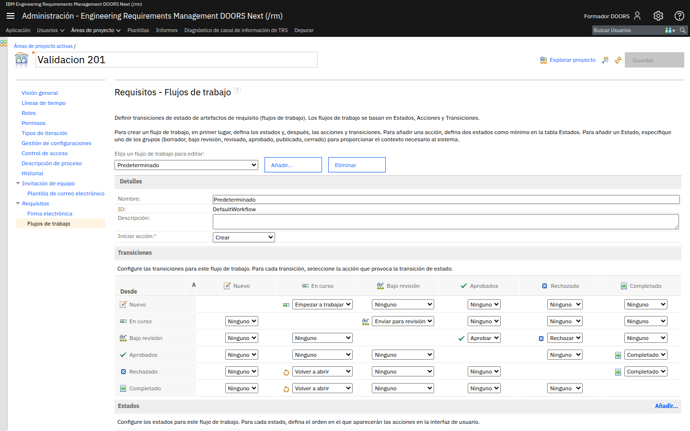
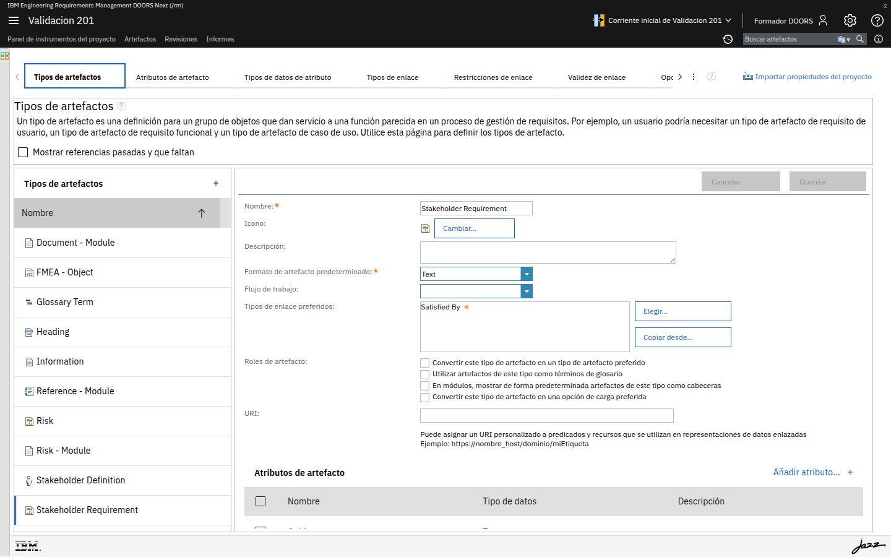
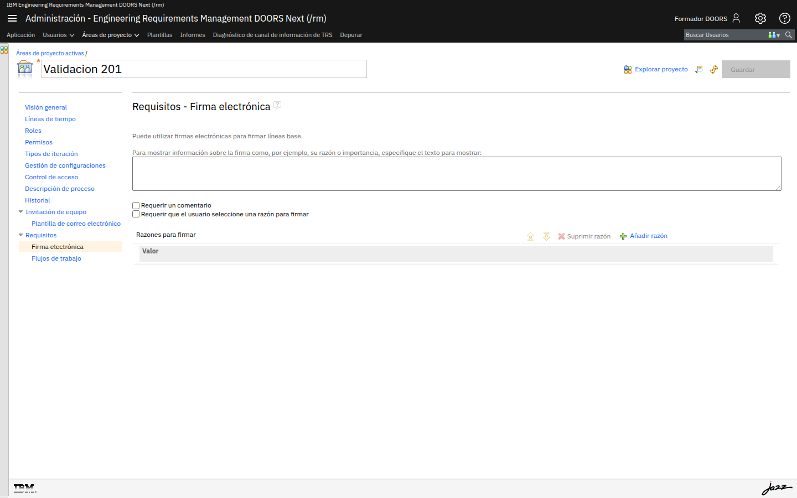

# M202-03 · Flujo de aprobación

[← Página anterior](M202-02-roles-y-permisos.md) · [Siguiente módulo →](../M203-consultas-vistas/README.md)

> [!NOTE]
> **Objetivo** — poner en marcha el ciclo de vida de los requisitos: entender el flujo de
> trabajo que ya trae el proyecto, **activarlo** en un tipo de artefacto y comprobar con dos
> usuarios distintos que las transiciones se cumplen de verdad.
>
> ⏱️ ~30 min · 🗂️ Área de proyecto → Flujos de trabajo, y el editor del metamodelo · 🎯 Resultado: requisitos con estado, que solo avanzan por el camino previsto.

---

## En qué consiste

Aquí se junta todo lo anterior. Tienes un modelo (M201), unos usuarios con roles y permisos
(M202-01 y 02) y ahora vas a añadir la dimensión que faltaba: el **tiempo**. Un requisito nace
como borrador, se trabaja, se envía a revisión, y solo entonces puede aprobarse.

Lo interesante es que ese flujo **ya existe** en tu proyecto desde que aplicaste la plantilla,
pero está **desconectado**: no hay ningún tipo de artefacto que lo use. Eso explica el misterio
que dejamos abierto en M201-02, cuando viste el campo *Flujo de trabajo* vacío.

## Antes de empezar necesitas

- Haber completado [M202-02](M202-02-roles-y-permisos.md).
- El tipo de artefacto **`Requisito de Seguridad`** que creaste en
  [M201-03](../M201-modelo-requisitos/M201-03-extender-el-modelo.md).

---

## Conceptos clave

| Concepto | Qué es |
|---|---|
| **Flujo de trabajo** | El conjunto de estados, acciones y transiciones que rige la vida de un artefacto |
| **Estado** | La situación del requisito: *Nuevo*, *En curso*, *Bajo revisión*, *Aprobados*, *Rechazado*, *Completado* |
| **Acción** | Lo que el usuario pulsa: *Empezar a trabajar*, *Enviar para revisión*, *Aprobar*, *Rechazar*, *Volver a abrir* |
| **Transición** | La combinación estado origen + acción → estado destino |
| **Iniciar acción** | La acción implícita al crear el artefacto, que determina su estado inicial |
| **Grupo de estado** | La categoría normalizada (borrador, bajo revisión, revisado, aprobado, publicado, cerrado) que permite al sistema interpretar tus estados |

> [!IMPORTANT]
> **Un flujo de trabajo no sirve de nada si no está asignado a un tipo de artefacto.** Es el
> error de configuración más frecuente, y da lugar a la queja clásica: *"la columna Estado
> aparece vacía y no me deja cambiarla"*.

---

## Paso a paso

### Paso 1 · Estudia el flujo que ya tienes

**Acción** — en el área de proyecto, despliega **Requisitos** en el menú de la izquierda y entra
en **Flujos de trabajo**.

**Qué ves** — en *Elija un flujo de trabajo para editar* está seleccionado **Predeterminado**
(identificador `DefaultWorkflow`), con **Iniciar acción: Crear**. Debajo, la **matriz de
transiciones**: las filas son el estado de origen (*Desde*) y las columnas el estado de destino.

Léela con calma, porque es el circuito completo de aprobación:

| Desde | Acción | Hasta |
|---|---|---|
| Nuevo | **Empezar a trabajar** | En curso |
| En curso | **Enviar para revisión** | Bajo revisión |
| Bajo revisión | **Aprobar** | Aprobados |
| Bajo revisión | **Rechazar** | Rechazado |
| Rechazado | **Volver a abrir** | En curso |
| Aprobados | **Completado** | Completado |
| Completado | **Volver a abrir** | En curso |

> [!IMPORTANT]
> **Fíjate en las casillas vacías, que son la parte importante.** No hay ninguna acción que lleve
> de *Nuevo* a *Aprobados*, ni de *En curso* a *Aprobados*. Es decir: **no se puede aprobar un
> requisito sin pasar por revisión**. Eso no lo garantiza un procedimiento escrito ni la buena
> voluntad del equipo: lo garantiza esta matriz.

> [!NOTE]
> **Por qué existe "Iniciar acción"** — determina en qué estado nace un artefacto. Con *Crear*,
> los requisitos nuevos aparecen en el primer estado del flujo. Si lo dejaras en *Ninguno*, los
> artefactos nacerían **sin estado**, y tendrías el mismo síntoma de columna vacía que vamos a
> arreglar en el paso siguiente.

> [!TIP]
> **Opciones** — más abajo está la sección **Estados**, con su propio **Añadir…**, donde puedes
> crear estados propios (*Pendiente de visado*, *Validado por cliente*). Al crear uno hay que
> asignarle un **grupo**; es lo que permite que el sistema entienda que tu estado significa
> *aprobado* aunque se llame de otra manera. Los botones **Añadir…** y **Eliminar** de arriba
> crean y borran flujos completos, por si necesitas circuitos distintos para requisitos y para
> riesgos.

---

### Paso 2 · Conecta el flujo a tu tipo de requisito

Este es el paso que hace que todo lo anterior sirva para algo.

**Acción** — sal del área de proyecto, abre tu proyecto y entra en **Gestionar propiedades de
proyecto** → **Tipos de artefactos**. Selecciona **`Requisito de Seguridad`**.

**Acción** — en el campo **Flujo de trabajo**, elige **Predeterminado**. Pulsa **Guardar**.

**Qué ves** — el campo, que en M201-02 estaba vacío para todos los tipos, ahora tiene un flujo
asignado en el tuyo.

> [!IMPORTANT]
> **Si el campo aparece en gris y no te deja elegir**, no eres miembro con el rol
> **Administrador**: repasa el [paso 4 de M201-01](../M201-modelo-requisitos/M201-01-proyecto-y-modelo-base.md).
> Es el mismo bloqueo de siempre, y a estas alturas ya deberías reconocerlo al instante.

> [!TIP]
> **Haz la prueba comparativa** — deja `System Requirement` **sin** flujo. Así tendrás en el
> mismo proyecto un tipo con ciclo de vida y otro sin él, y podrás ver la diferencia de
> comportamiento en la tabla. Es la mejor demostración de que el estado depende del **tipo**.

---

### Paso 3 · Comprueba el estado inicial

**Acción** — entra en **Artefactos**, abre la carpeta `01 Requirements` y crea un artefacto nuevo
de tipo **`Requisito de Seguridad`**:

`El sistema debe detener la infusion si la presion supera el umbral configurado.`

**Acción** — muestra la columna de estado: abre el menú de columnas (**Más acciones ▤ → Configurar
las columnas a visualizar…**) y añade la columna **Estado**.

**Qué ves** — tu requisito nuevo aparece en el primer estado del flujo, y el requisito que
creaste en M201-03 (antes de asignar el flujo) puede aparecer **sin estado**.

> [!NOTE]
> **Por qué esa diferencia** — el estado se asigna al **crear** el artefacto, aplicando la
> *Iniciar acción* del flujo vigente en ese momento. Los artefactos que existían antes de conectar
> el flujo no se actualizan solos. En una implantación real esto importa mucho: al introducir un
> ciclo de vida en un proyecto en marcha, hay que decidir qué se hace con los miles de requisitos
> que ya existen.

---

### Paso 4 · Recorre el circuito como autor

**Acción** — abre una **ventana privada** y entra en `https://localhost:9443/rm` como
`autor` / `autor`. Abre tu proyecto y localiza el requisito del paso anterior.

**Acción** — selecciónalo y ejecuta la acción de flujo **Empezar a trabajar**, y después **Enviar
para revisión**. Las acciones aparecen en el panel del artefacto o en la celda de la columna
*Estado*, según cómo lo abras.

**Qué ves** — el estado va cambiando: *Nuevo* → *En curso* → *Bajo revisión*.

**Acción** — ahora intenta **Aprobar** el requisito, siendo `autor`.

**Qué ves** — no puedes. La acción *Aprobar* no está disponible para este usuario.

> [!IMPORTANT]
> **Acabas de comprobar la separación de funciones funcionando.** El autor ha podido llevar su
> requisito hasta la puerta de la revisión, y ahí se ha detenido. No por una norma interna, sino
> porque la herramienta no le ofrece la acción.

---

### Paso 5 · Aprueba como aprobador

**Acción** — cierra esa ventana privada, abre otra y entra como `aprobador` / `aprobador`.
Localiza el mismo requisito.

**Acción** — ejecuta la acción **Aprobar**.

**Qué ves** — el requisito pasa a **Aprobados**.

**Acción** — con la sesión de `aprobador` todavía abierta, intenta **editar el texto** del
requisito.

**Qué ves** — no te deja: en M202-02 le denegaste *Guardar artefacto*.

> [!IMPORTANT]
> **Este es el resultado del módulo entero.** Tienes un requisito que ha recorrido un circuito
> formal, aprobado por alguien distinto de quien lo escribió, y ese alguien no puede alterar lo
> que aprueba. Con eso ya puedes responder a un auditor.

---

### Paso 6 · Deja la traza de auditoría

**Acción** — vuelve a tu sesión de administrador. Selecciona el requisito y, en el panel derecho,
abre **Historial**.

**Qué ves** — la secuencia de versiones del artefacto, con **quién** hizo cada cambio y
**cuándo**, incluidos los cambios de estado.

**Acción** — mira ahora el otro registro: en el área de proyecto, entra en **Historial**.

**Qué ves** — los cambios de **configuración del proceso**: cuándo se añadieron miembros, cuándo
se creó el rol *Aprobador*, cuándo cambiaron los permisos.

> [!NOTE]
> **Son dos auditorías distintas y las dos hacen falta.** La del artefacto contesta *"¿quién
> aprobó este requisito?"*. La del área de proyecto contesta *"¿quién le dio permiso para
> aprobarlo?"*. En una auditoría de verdad preguntan las dos cosas.

> [!TIP]
> **Y hay una tercera, la más formal** — en el área de proyecto, **Requisitos → Firma
> electrónica** permite exigir **firma** al crear una línea base, con comentario obligatorio y
> un motivo elegido de una lista que tú defines.
>
> 
>
> Es el mecanismo que se usa en entornos regulados (FDA 21 CFR Part 11). Lo aplicarás sobre
> líneas base reales en el módulo [M206](../M206-configuraciones/README.md).

---

## ✅ Resultado

- Sabes leer una matriz de transiciones y, sobre todo, interpretar sus **huecos**.
- Tu tipo `Requisito de Seguridad` tiene el flujo asignado y sus artefactos nacen con estado.
- Has recorrido el circuito con dos usuarios: el autor no puede aprobar, el aprobador no puede editar.
- Sabes dónde están las tres trazas de auditoría: artefacto, proceso y firma electrónica.

## Comprueba

- [ ] En el tipo `Requisito de Seguridad`, el campo **Flujo de trabajo** dice *Predeterminado*.
- [ ] Un requisito nuevo de ese tipo aparece con estado, y la columna **Estado** lo muestra.
- [ ] Como `autor` puedes llegar a *Bajo revisión* y **no** ves la acción *Aprobar*.
- [ ] Como `aprobador` puedes *Aprobar* y **no** puedes editar el texto.
- [ ] El **Historial** del artefacto muestra los cambios de estado con autor y fecha.

## Errores frecuentes

> [!WARNING]
> - **La columna Estado sale vacía y no se puede editar** → el tipo de ese artefacto no tiene
>   flujo asignado (paso 2), o el artefacto se creó **antes** de asignarlo (paso 3).
> - **No veo las acciones del flujo** → selecciona el artefacto y busca en el panel derecho; según
>   la vista, las acciones salen en el panel o en la celda de estado, no en la barra superior.
> - **El autor sí puede aprobar** → tiene más roles de los que crees. Revisa **Miembros** y la
>   columna *Roles de proceso*: los permisos se suman.
> - **El aprobador sí puede editar** → misma causa. O no guardaste el área tras cambiar permisos.
> - **Cambié permisos y el usuario no lo nota** → tiene que cerrar sesión y volver a entrar.
> - **Asigné el flujo y los requisitos antiguos siguen sin estado** → es el comportamiento
>   correcto, no un fallo. El estado se fija al crear el artefacto.

## 📝 Autoevaluación

**1.** Tu cliente exige que ningún requisito pueda llegar a *Aprobado* sin haber pasado por
revisión. ¿Qué le muestras como prueba de que eso está garantizado?

**2.** Un proyecto en marcha, con 3.000 requisitos ya escritos, quiere introducir el ciclo de
vida. Al asignar el flujo, ¿qué pasa con esos 3.000 y qué propondrías hacer?

**3.** Quieres que los requisitos ya aprobados no se puedan editar **en absoluto**, ni por el
autor. Con lo que has visto, ¿cómo lo abordarías y qué limitación tiene el enfoque de solo
permisos?

Ver respuestas

 

**1.** La **matriz de transiciones** del flujo de trabajo, señalando que las celdas que llevarían
de *Nuevo* o *En curso* directamente a *Aprobados* están **vacías**: no existe ninguna acción que
haga ese salto, así que el camino a *Aprobados* pasa obligatoriamente por *Bajo revisión*. Es una
garantía estructural de la herramienta, no un compromiso del equipo. Como prueba complementaria,
el **historial** de un requisito aprobado muestra la secuencia de estados por la que pasó.

**2.** No les pasa nada: **conservan su ausencia de estado**, porque el estado se asigna al crear
el artefacto aplicando la *Iniciar acción*, y esos ya existían. Quedarías con un proyecto de dos
velocidades, que es peor que no tener flujo, porque las consultas por estado darían resultados
incompletos y nadie se fiaría de ellas.

Lo razonable es planificar una **migración**: decidir en qué estado debe quedar cada grupo de
requisitos (por ejemplo, todo lo de la última línea base aprobada pasa a *Aprobados* y el resto a
*En curso*) y aplicarlo de forma masiva. Con la interfaz se hace por columnas sobre una vista
filtrada; para 3.000 artefactos, lo sensato es automatizarlo con la **API OSLC** del módulo
[M209](../M209-interoperabilidad/README.md).

**3.** Con permisos puedes denegar *Guardar artefacto* a los roles que no deban editar, pero eso
es todo o nada: el autor perdería la capacidad de editar **cualquier** requisito, también los
borradores, lo que le impediría trabajar. El permiso se concede por **rol y operación**, no *"por
operación cuando el artefacto está en tal estado"*.

El enfoque completo combina tres piezas: el **flujo de trabajo**, que obliga a *Volver a abrir* un
requisito aprobado antes de tocarlo, dejando traza del cambio de estado; las **líneas base** del
módulo [M206](../M206-configuraciones/README.md), que congelan una versión de forma inmutable de
verdad; y la **firma electrónica**, que deja constancia formal de quién dio por bueno ese
conjunto. La inmutabilidad real la da la línea base, no el permiso.

