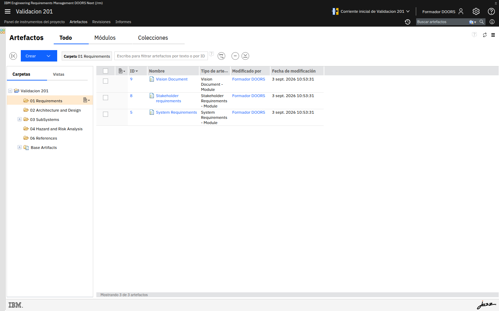

# M205-02 · Copia frente a compartir

[← Página anterior](M205-01-componentes-y-referencias.md) · [Siguiente página →](M205-03-componentes-con-cm.md)

> [!NOTE]
> **Objetivo** — sentir en la piel lo que pasa cuando **copias** un requisito entre contextos,
> frente a reutilizar el **modelo**. Dejar escrita la regla de cuándo copiar sí es correcto.
>
> ⏱️ ~15 min · 🗂️ Dos áreas de proyecto · 🎯 Resultado: un experimento con IDs distintos y una regla de decisión.

---

## Paso a paso

### Paso 1 · Copia un artefacto al otro proyecto

**Acción** — en el producto, **Artefactos → 01 Requirements**. Abre tu `Requisito de Seguridad`.
**Más acciones** del artefacto o de la vista: **Duplicar** / **Copiar** / **Enviar a** (el
nombre varía). Destino: la biblioteca, o crea el artefacto a mano pegando el texto.

**Qué ves** — un **ID nuevo**. El historial **no** continúa. El enlace **Mitiga** **no** viaja
salvo que copies también el riesgo o recrees el enlace.

> [!IMPORTANT]
> **Acabas de crear un gemelo.** Si mañana corriges una errata en el producto, la biblioteca
> sigue mintiendo. Eso es exactamente el antipatrón de "reutilizar pegando".

---

### Paso 2 · Cambia un gemelo

**Acción** — en la copia, altera el umbral de tiempo ("2 segundos" → "3 segundos"). No toques
el original.

**Acción** — abre los dos artefactos en dos pestañas.

**Qué ves** — dos verdades. Ningún suspect link entre ellos: **no hay enlace**. La validez de
M204 no aplica a copias.

---

### Paso 3 · Cuándo la copia *sí* es la herramienta

La copia es correcta cuando el destino **debe poder divergir** o **no comparte repositorio**:

| Situación | ¿Copia? |
|---|---|
| Mismo producto, dos equipos, misma cláusula de seguridad | No: referencia / componente (M205-03) |
| Enviar un paquete a un proveedor por **ReqIF** (M209) | Sí: snapshot |
| Fork de un producto que nunca se realineará | Sí, y se asume el coste |
| "Por si acaso" al empezar el proyecto B | No |

**Acción** — borra o marca la copia de la biblioteca con un comentario `EXPERIMENTO - no usar`
para que no se convierta en canon por accidente.

---

## ✅ Resultado

- Has visto IDs, historial y enlaces romperse al copiar.
- Tienes una tabla de decisión copia / compartir.

## Comprueba

- [ ] Los dos textos pueden diferir sin aviso automático.
- [ ] La biblioteca no quedó como almacén de copias basura (las limpiaste o las etiquetaste).

## 📝 Autoevaluación

Un proveedor te devuelve el ReqIF con los requisitos de seguridad **cambiados**. ¿Fusionas a
ciegas sobre la biblioteca canónica?

Ver respuesta

 

No. El ReqIF es una **copia con cambios de un tercero**. Se compara (diff), se decide qué
entra en el canon y se importa con control. Fusionar a ciegas convierte al proveedor en
autor del modelo de toda la organización.

