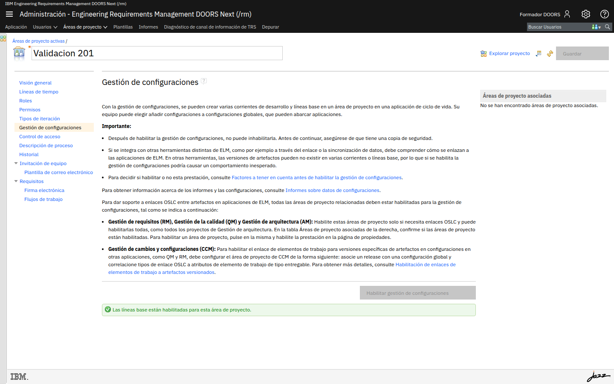

# M206-03 · Streams y change sets

[← Página anterior](M206-02-firma-y-entrega.md) · [Siguiente módulo →](../M207-revisiones/README.md)

> [!NOTE]
> **Objetivo** — con **CM habilitada**, crear una corriente de mantenimiento, un change set y
> entregarlo. Sin CM, este laboratorio es **lectura + parada**, no un simulacro con carpetas.
>
> ⏱️ ~20 min · 🗂️ Selector de configuración (arriba, junto al nombre del proyecto) · 🎯 Resultado: un stream extra y un lote entregado, o la parada documentada.

---

## Si el botón sigue deshabilitado

1. La clave se pide en **RM → Administración de aplicación → Propiedades avanzadas**
   (*Especifique la clave de licencia para habilitar la gestión de la configuración*).
2. Se obtiene en jazz.net (versión de ELM de la imagen). El formador puede hornearla en la
   imagen para que **no** sea un taller de 40 minutos en clase.
3. Después, en el área, **Habilitar gestión de configuraciones**. **No hay vuelta atrás.**

Hasta entonces, M206-01 y M206-02 ya cubren hitos y firma. Sigue a M207.

---

## Paso a paso (CM activa)

### Paso 1 · Reconoce el selector de configuración

**Acción** — arriba, junto al proyecto, deja de ser solo *Corriente inicial de…*. Abre el
selector de configuraciones.

**Qué ves** — streams y baselines de **componente**. El metamodelo que editaste en M201 vive
**en una configuración**: cambiar tipos en un stream de mantenimiento no cambia el de
producción hasta entregar.

---

### Paso 2 · Stream de mantenimiento

**Acción** — crea un stream `mant-hotfix-sensor` a partir de la baseline `BL-diseno-v1` (o
de la corriente inicial, si aún no hay baseline de componente).

**Qué ves** — un espacio de trabajo paralelo. Los requisitos de producción no se editan ahí
por accidente si cambias de configuración.

---

### Paso 3 · Change set

**Acción** — crea un **conjunto de cambios** `cs-umbral-oclusion`. Edita el requisito de los
2 segundos **dentro** de ese change set.

**Qué ves** — los cambios van al lote, no "sueltos" en el stream (según esté configurado el
proyecto: a veces el change set es obligatorio).

---

### Paso 4 · Entregar y comparar

**Acción** — entrega el change set al stream de mantenimiento. Compara ese stream con la
corriente inicial / la baseline de producto.

**Qué ves** — el mismo tipo de diff que M206-01, pero entre **líneas de evolución**, no solo
entre foto y módulo.

---

### Paso 5 · Lo que no hay: GCM

No busques una pantalla que una "esta baseline de RM + este plan de ETM + este hito de EWM".
Eso es **Global Configuration**. En este curso se explica: la versión de producto en ELM
completo es un objeto GCM que apunta a configuraciones de cada aplicación. Sin `/gc`, RM y
QM se versionan por separado; el "producto v1.2" se documenta por convención de nombres
(`BL-diseno-v1` + plan de pruebas `TP-v1`).

---

## ✅ Resultado

- Stream y change set reales, **o** parada honesta.
- Sabes que el metamodelo también es versionable con CM.

## Comprueba

- [ ] No habilitaste CM en un área que no sea la de laboratorio.
- [ ] Si trabajaste, el hotfix no se editó "sin querer" en la corriente inicial.

## 📝 Autoevaluación

¿Un change set sustituye el flujo de aprobación de M202?

Ver respuesta

 

No. El change set agrupa **ediciones** para entregarlas juntas. El flujo gobierna el
**estado de negocio** del requisito. Puedes entregar un lote de borradores; no por ello
están aprobados. Al revés: un requisito aprobado en producción no debería parchearse en un
change set sin *Volver a abrir* (M202-03).

