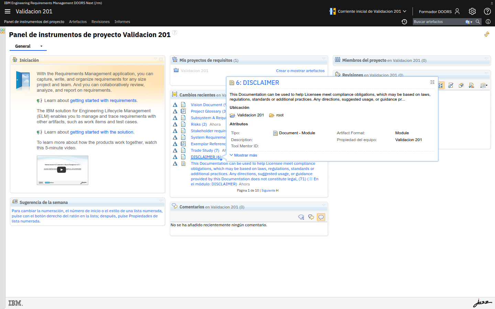

# M208-01 · Panel de instrumentos del proyecto

[← Página anterior](README.md) · [Siguiente página →](M208-02-indicadores-de-cobertura.md)

> [!NOTE]
> **Objetivo** — dejar el **panel de instrumentos** como página de arranque del equipo, no
> como portada vacía de la plantilla.
>
> ⏱️ ~15 min · 🗂️ Pestaña **Panel de instrumentos del proyecto** · 🎯 Resultado: widgets útiles para autor y dirección.

---

## Paso a paso

### Paso 1 · Mira lo que ya hay

**Acción** — abre el panel del proyecto.

**Qué ves** — *Cambios recientes* y atajos. Es un comienzo, no un cuadro de mando.

---

### Paso 2 · Añade widgets

**Acción** — **Añadir widget** / *Personalizar* (icono de lápiz o *Añadir contenido*, según
versión). Incorpora, si existen en el catálogo:

- **Revisiones** (las abiertas),
- **Favoritos** o consultas guardadas,
- **Enlaces rápidos** a `Direccion - clase C` y `Cobertura - clase C sin prueba`,
- un widget de **HTML/texto** con el mapa: *vistas oficiales de este proyecto* y sus nombres.

**Guarda** el diseño del panel.

> [!IMPORTANT]
> **El panel no calcula cobertura.** Enlaza a las vistas que sí. Un widget bonito que no
> apunta a un filtro es decoración.

---

### Paso 3 · Permisos de panel

**Acción** — recuerda M202: *Todo el mundo* tenía **denegado** gestionar paneles. El
*Administrador* publica el panel de **proyecto**; los personales los arma cada uno.

**Qué ves** — si un autor no puede añadir widgets al panel de proyecto, es correcto. Que
añada un panel **personal** con las mismas vistas.

---

## ✅ Resultado

- Panel de proyecto con accesos a las vistas de gobierno.
- Distinción panel de proyecto / personal.

## Comprueba

- [ ] Un enlace o texto lista las vistas compartidas canónicas.
- [ ] No prometiste gráficas JRS que no existen.

## 📝 Autoevaluación

Dirección pide "un gráfico de tendencia de requisitos aprobados a 12 meses". ¿Qué dices?

Ver respuesta

 

Que **esta imagen** no tiene LQE/JRS. Se puede exportar CSV periódicamente y graficar fuera,
o implantar Report Builder en el ELM de verdad. Mentir con un widget estático es peor. El
indicador **ahora** es la vista filtrada por estado y la baseline mensual (M206).

