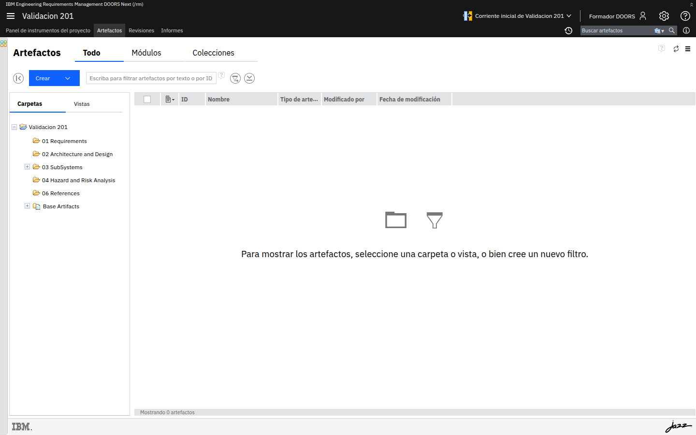
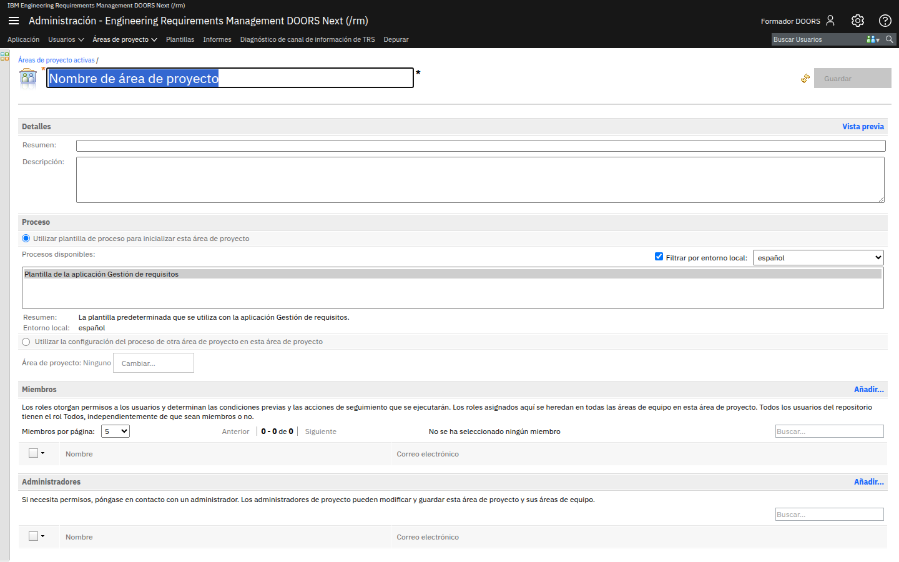

# M209-01 · Intercambio mediante ReqIF

[← Página anterior](README.md) · [Siguiente página →](M209-02-oslc.md)

> [!NOTE]
> **Objetivo** — exportar a **ReqIF** el alcance de la revisión (colección o vista filtrada),
> entender qué viaja y qué no, y dejar escrita la política de **vuelta**.
>
> ⏱️ ~20 min · 🗂️ Más acciones → ReqIF · 🎯 Resultado: un fichero `.reqif` / `.reqifz` y un mapa de pérdidas.

---

## Conceptos clave

| Concepto | Qué es |
|---|---|
| **ReqIF** | XML estándar de intercambio de requisitos (OMG) |
| **.reqifz** | Paquete comprimido (imágenes, adjuntos) |
| **Mapeo de tipos** | Al importar, hay que decir qué tipo del fichero es qué tipo del proyecto |
| **ID externo** | El identificador que el otro sistema conoce; no tiene por qué ser el ID de DNG |

---

## Paso a paso

### Paso 1 · Prepara el alcance

**Acción** — no exportes el proyecto entero. Abre la colección `Revision de diseño - bomba v1`
o la vista `Direccion - clase C` (desde **Artefactos**, carpeta o pestaña **Colecciones**).

> [!IMPORTANT]
> Un ReqIF de 4.000 artefactos de ejemplo de plantilla es un incidente diplomático con el
> proveedor y un mapeo imposible.

---

### Paso 2 · Exporta

**Acción** — **Más acciones → Exportar → ReqIF** (a veces bajo *Intercambiar*). Incluye
atributos y tipos de enlace si el asistente lo permite. Genera el fichero.

**Qué ves** — un paquete descargable. Ábrelo como zip si es `.reqifz` y confirma que hay XML.

---

### Paso 3 · Inventario de lo que *no* viaja bien

Completa esta tabla para **tu** exportación (sí/no/parcial):

| Pieza | ¿Viaja? |
|---|---|
| Texto del requisito | |
| Enumeración Criticidad IEC 62304 | |
| Enlace Mitiga (tipo propio) | |
| Enlace Validated By a ETM | |
| Historial / flujo de estados | |
| Comentarios de la revisión DR-01 | |
| Baseline | |

> [!NOTE]
> Los enlaces OSLC a QM **casi nunca** son un requisito "dentro" del ReqIF: el proveedor no
> tiene tu ETM. Los tipos **propios** viajan si el otro extremo mapea la URI; si no, se
> caen a texto.

---

### Paso 4 · Política de importación (sin pegar a ciegas)

**Acción** — **Importar ReqIF** en un **proyecto vacío de pruebas** (crea `Sandbox ReqIF` desde
`/rm/admin` si hace falta), no sobre la biblioteca canónica.

**Qué ves** — el asistente pide mapeo. Si importas sobre el producto real, puedes **duplicar**
tipos y artefactos (M205-02).

**Regla:** la vuelta del proveedor se compara, se decide, se importa en sandbox, se copia con
criterio al canon. Nunca al revés.

---

## ✅ Resultado

- Un ReqIF acotado.
- Tabla de pérdidas rellenada.
- Sandbox de import, no el canónico.

## Comprueba

- [ ] El fichero no pesa como todo Medical Devices.
- [ ] No importaste sobre `Biblioteca - requisitos de seguridad` a la primera.

## Errores frecuentes

> [!WARNING]
> - **Permiso Exportar / Gestionar ReqIF denegado** → M202, rol *Todo el mundo* lo tenía en
>   rojo en varias operaciones de informes/ReqIF. Concédelo al Autor o al Administrador.
> - **El proveedor dice que "no se ve Mitiga"** → tipo propio sin URI acordada. En M201 el
>   campo URI del tipo de enlace era exactamente para esto.

## 📝 Autoevaluación

¿ReqIF sustituye OSLC en tiempo real con ETM?

Ver respuesta

 

No. ReqIF es **lote, asíncrono, entre organizaciones**. OSLC es **enlace vivo** entre
aplicaciones que se ven en red. Usar ReqIF cada noche "para sincronizar QM" es un antipatrón
caro. Usar OSLC para mandar un paquete a un proveedor sin red común, también.

